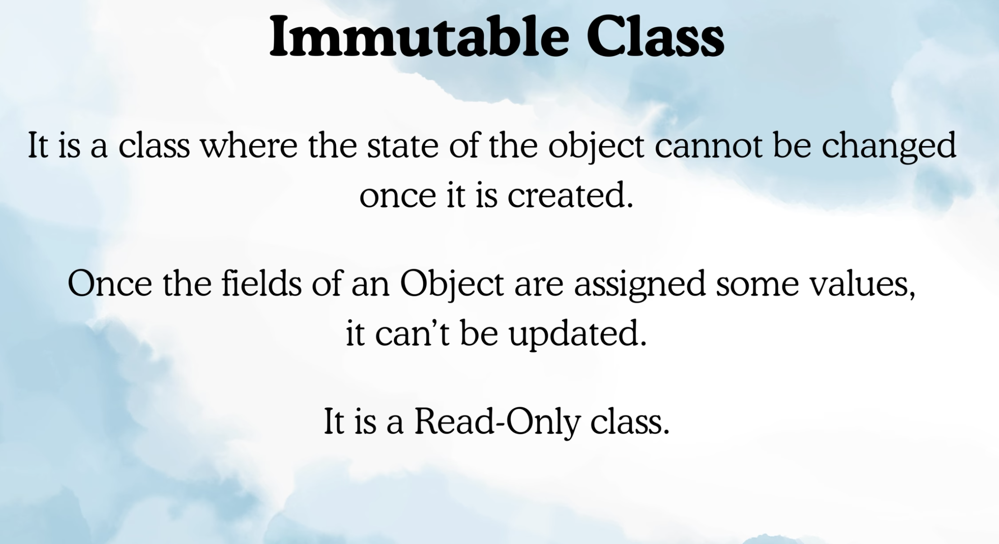
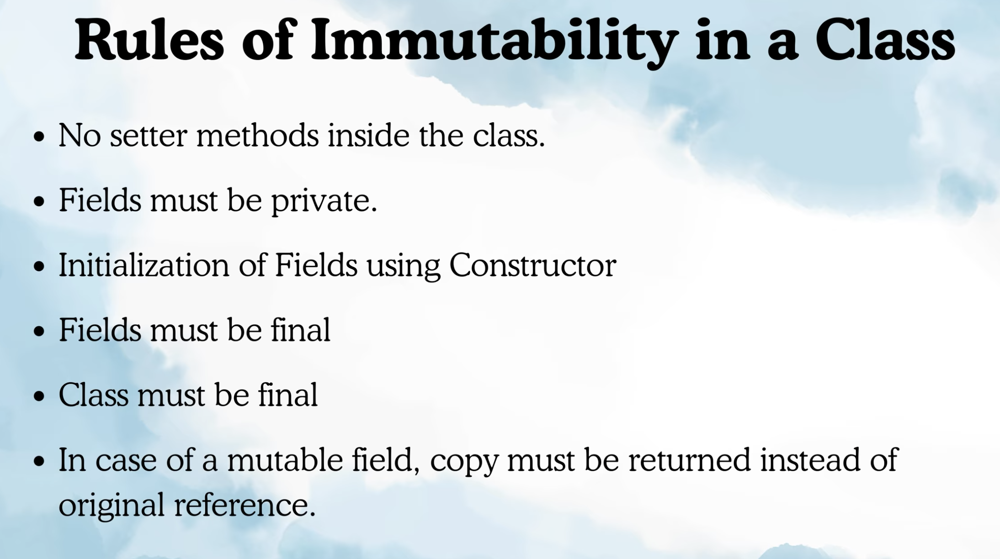

Immutable classes in java:

What is immutable class ?

Rules of Immutable classes: 

A mutable child class make the parent class also mutable. So make the class final so class can extend.

Last Point to return the copy instead of returning original one.
2 cases one is getter and constructor.