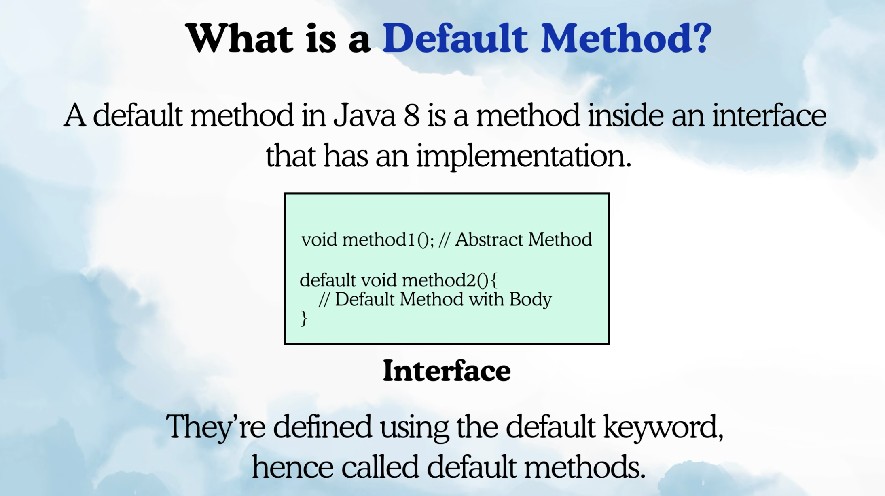
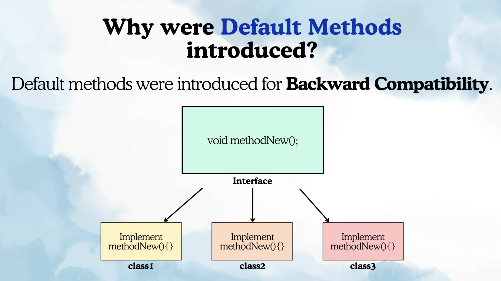
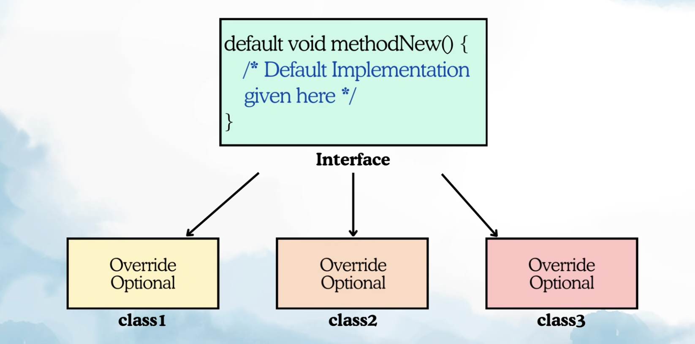

Default Method:

Why Default methods introduced ?

if there is an interface and there are 100 implemenatation classes already present and there is small functionality which is common you want to add then earlier to add any method what you do add abstract method in interface and you have to implement that method in all other 100 classes other wise code will break, that is not backward compatible that is why default methods introduced so that existing code should not break.

Ex: List Interface which is implementated by lot of classes and java is used world wide.
So default methods is present in list interface as well.

If we declare any abstract method in interface then all its implementation classes need to implment that method otherwise it will give compile time error.

Since Java 8 we can create default methods in interface and all child classes are not force to override these methods, they can override if they want.

RULES FOR DEFAULT METHODS:
1. We can have multipe default methods in interface.
2. Default methods can be overriden.
3. So when ever class is implementing multiple interfaces with the same default method then class must override that default method. Because of below prob:

Multiple Inheritance problem (Diamond Problem):

ex: Calculator have default method operate which returns sum
    Caluclator1 interface have default method operate which returns product.

    CaluclateImpl implements Calculator and Calculator then there is ambiguity to cal which operate method 
    Sol: CaluclateImpl has to implement that default method to tell which to call.  

4. If a class extends class and implements interface with same method then  Class will have more precedence than interface.

ex: let say Calculator1 is class and Calculator is interface
and CalculatorImpl extends Calculator1 impements Calculator1

Now we do not need to overide the default method.
Now in Main class which operate will be called ?
It will be of Class 1 as it have more precedence.

5. Default Method cannot ovveride the method from Object class.

