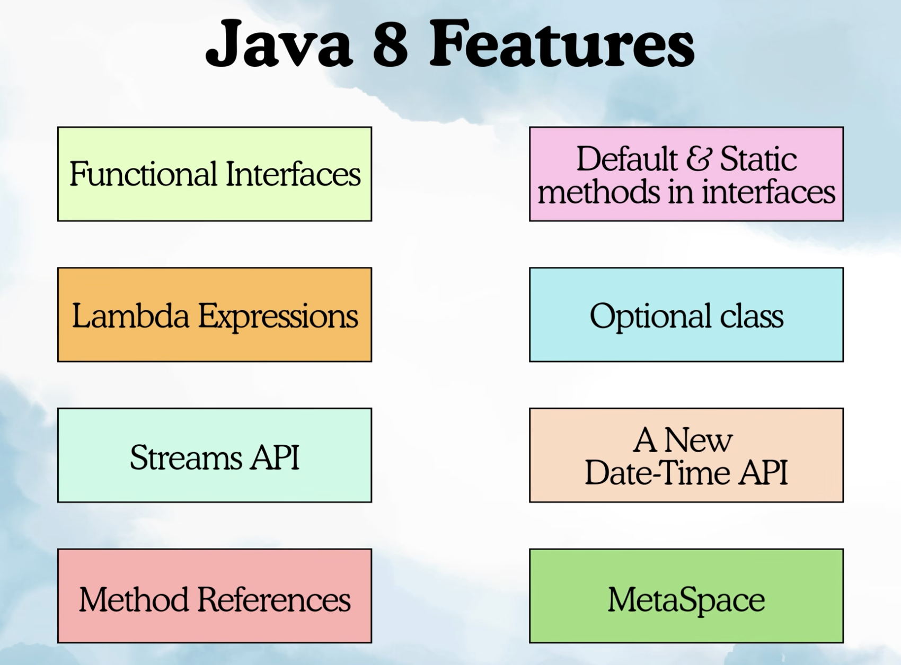
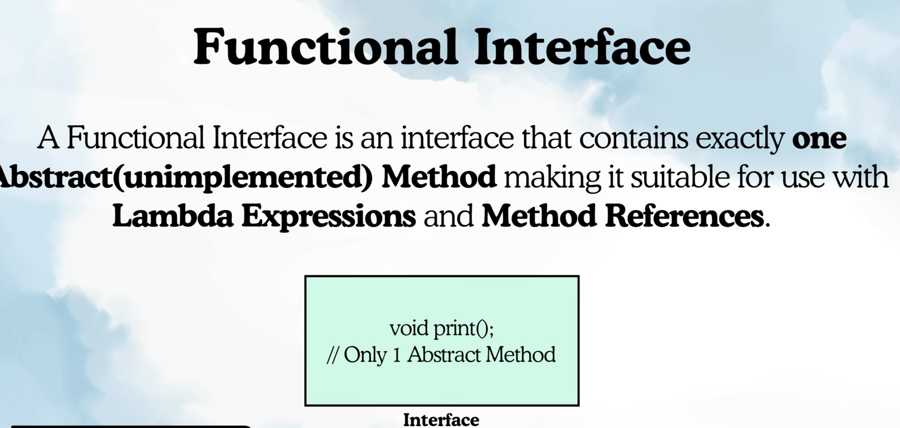
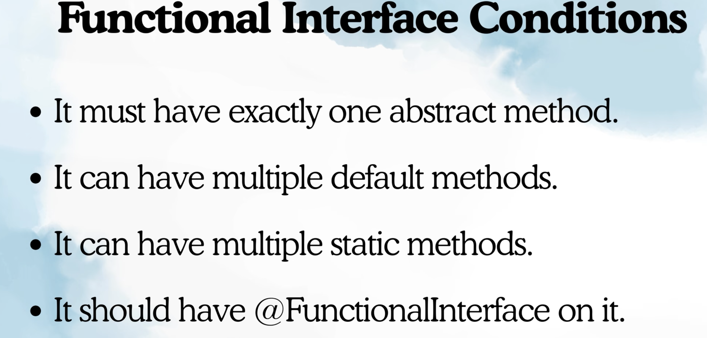
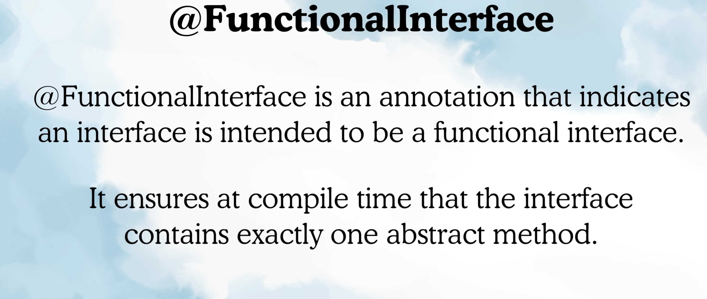
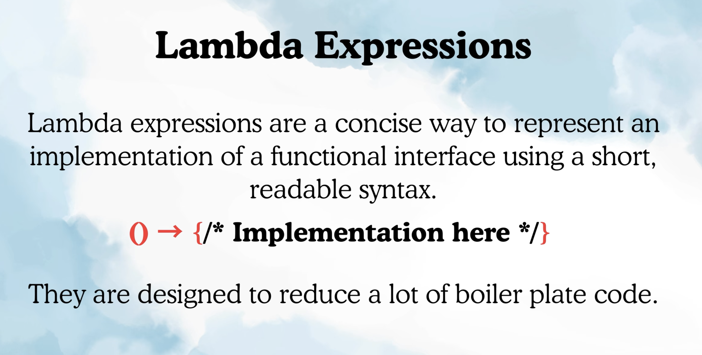
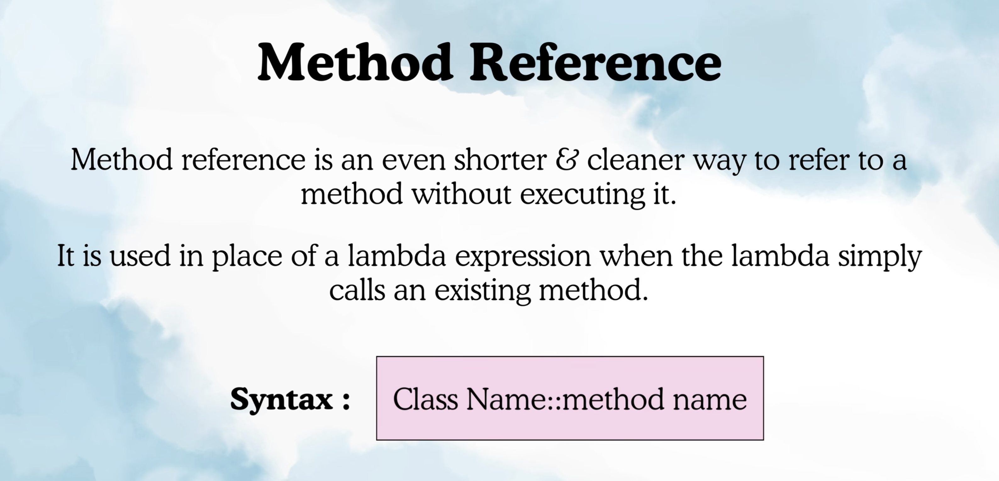
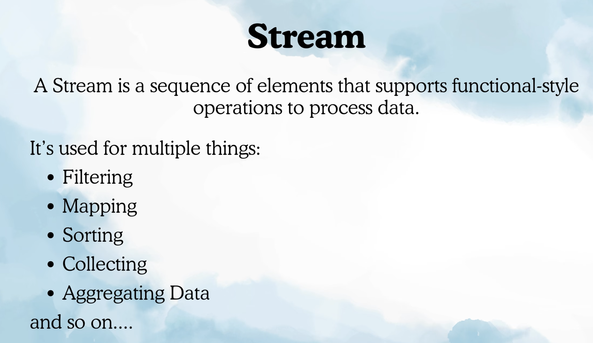
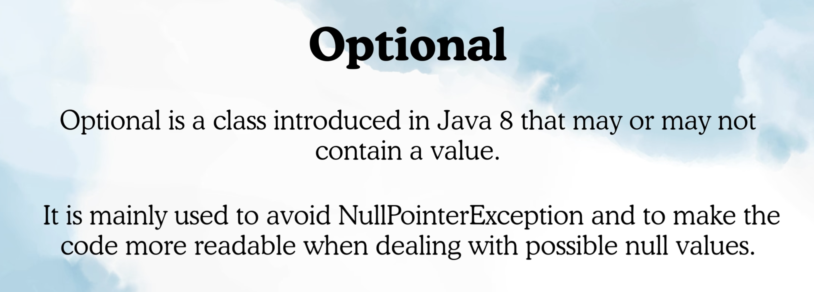
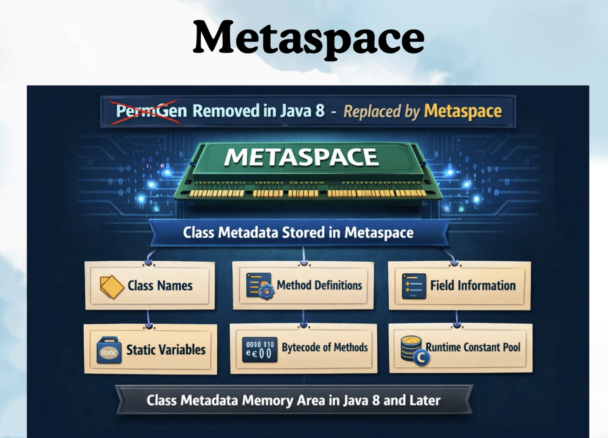

JAVA 8 FEATURES:

Functional Interface:

Functional Interface Conditions:

@FunctionInterface: 

LAMBDA EXPRESSION:

Vehicle example, what annonymous class solves and there is better way of this using lambda.
See Demo class for notes.

I should not be creating child class like CAR and BIKE everytime i want to implement one method. I can simply write annonuymous class which is less code. 
Lamda goes one step further and reduces the code.

We have only one implemented method start() so compiler already knows that.
Vehicle v = ()-> {print();};

It is only possible with functional interface as it has only one abstract method.

Another Ex: Calculator.

METHOD REFERENCE:

When ever in lambda implementation, you are just calling a method of class you can use this.
ex: Greeting and myInterface. 

ex: MyInterface2 and MathUtil

There are 4 types of method refereces which we will see later.

STREAMS:

Stream is actually an interface. We actually use it for data processing in functional style manner.

Any Collection can be converted into Stream using stream method where we can perform data processing in function style manner.

OPTIONAL CLASS:

ex: User, UserService

JAVA 8 DATE TIME API 

it is java.time package.

METASPACE:

Before JAVA 8 this information is used to be store in permanent generation area.

