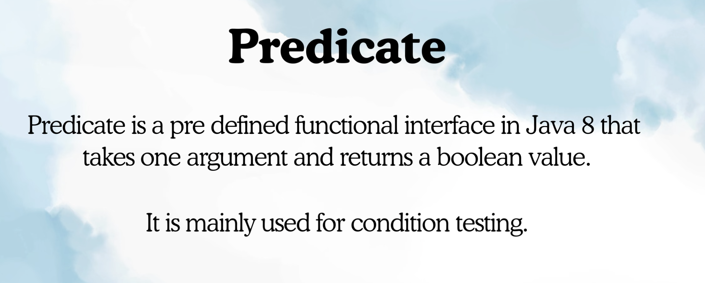
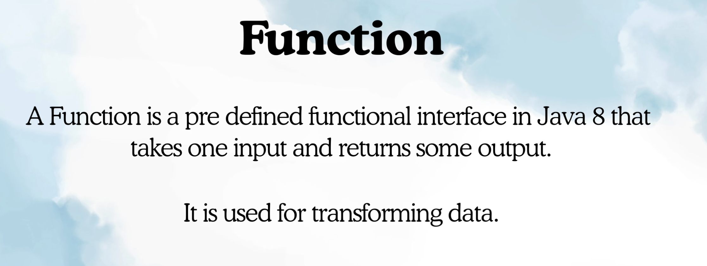
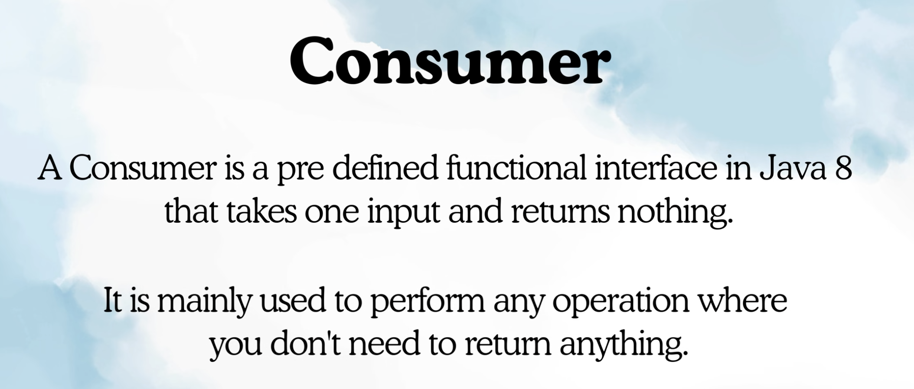
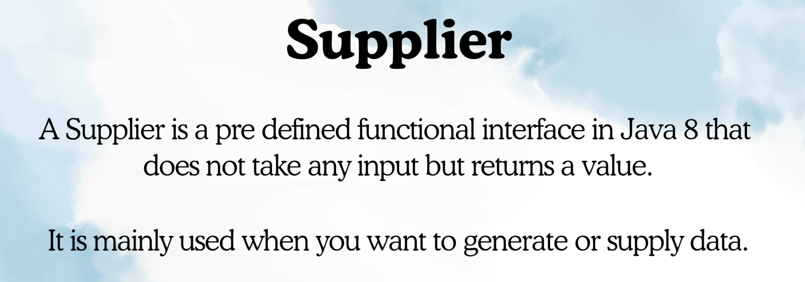

4 Predifined Important Functional Interfaces: 
 -> Predicate
 -> Consumer
 -> Fucntion
 -> Supplier

These interfaces are heavily used with lambda and Streams Api.

Predicate:

Funcation:

unlike, predicate return type is not boolean, it can be anything.

Consumer:

Supplier:

