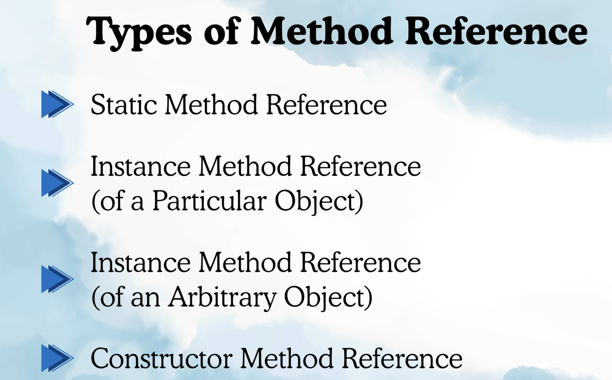
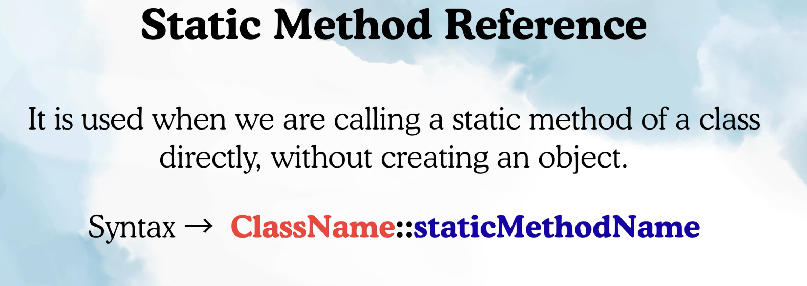
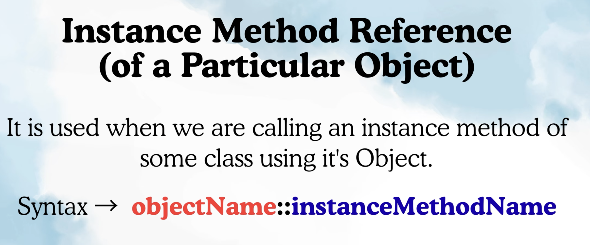
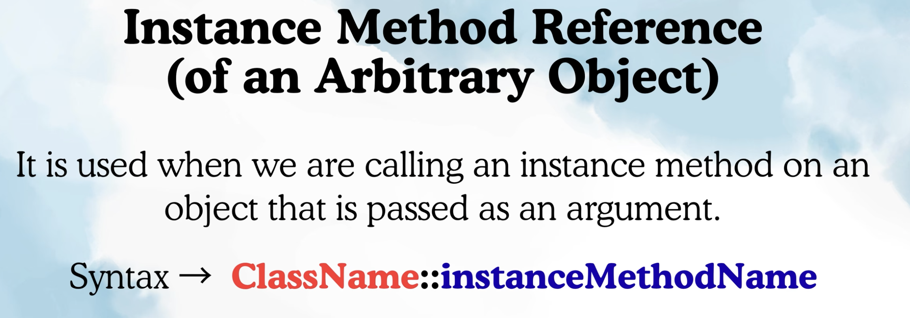
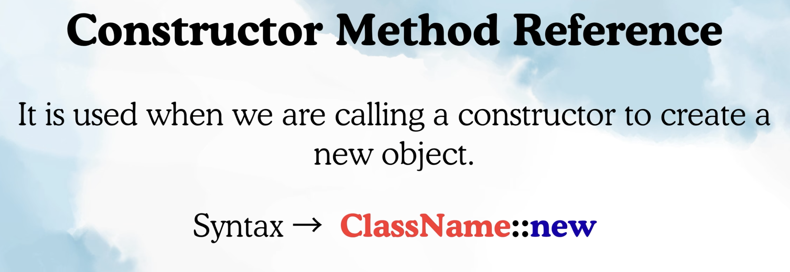

METHOD REFERENCE:

-> It is the shorter way to implement the functional interface. 
-> WAIT, Doesnt lambda do the same thing ? Yes.
-> But at times, We can make the syntax more optimized than lambda using method reference (WHEN ELIGIBLE)

Lambda can be converted into Method Reference only if 2 conditions present:
1. Implementaion should be one liner.
2. In that one liner there should be some method call happening.

ex: 

Calculator calc = (a, b) -> {
    return a+b;
}

Above example is not eligible for conversion.
1. it fulfills as it is single liner 
2. There is not method call as it is just returning a+b.

Calculate calc = (a, b) -> {
    return MathOperations.add(a, b);
}

Now this is elgible as it fullfill both conditions.

Calculate calc = MathOperations :: add;

TYPES OF METHOD REFERENCES:

1. Static Method Reference:

Earlier example is static Method reference.

2. Instant Method Referece (of an particular object):

ex: validate interface and positve.

3. Instant Method Reference (of an arbitrary object):

We are calling method using an argument not with object like earlier
ex:
StringOperations so = (str) -> {return str.length();};

str is an argument and calling method length using argument not by object.

StringOperations so = String::length;    
str argument was string so String and method calling was length.
className::methodName;

4. Constructor Method Reference: 

ex: Creator, User, Product