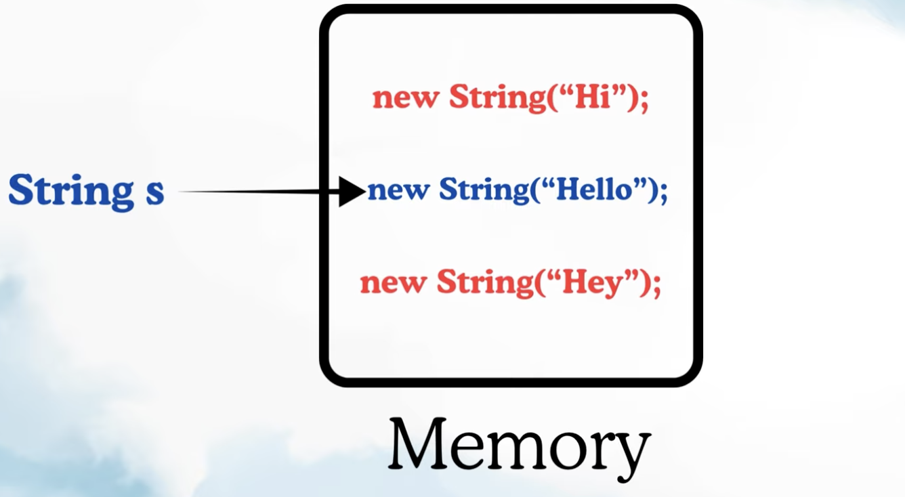

FINAL VS FINALLY VS FINALIZE: 

Rules on Final Field:

1. Final Field must be intitialized, you cannot just declare it and leave.
2. It does not allow to change the value of the field.
3. final variable can also be initialize using constructor.

Note: Using Final on field does not mean that we can have only value for that field.
      But yes one value for final field for one particular object.

Rules on Final Method: 
1. When we extend the classes then it will restrict user to not override methods which are marked final.

Rules on Final Class:
1. We cannot extend final classes, if we want to restrict some classes to get extended.

FINALLY: 
    -> This block is used with try/catch. 
    -> try/catch is used in exception handling and finally block always gets executed whether or not there will be an exception.

Lets understand with simple divide example.

FINALIZE: 
    -> It is a method which is called at the time of Garbaje collection by JVM.
    -> This belongs to Parent Class Object.
    -> G.C is a process where JVM cleans up memory by deleting all unreferenced objects.
    -> Unreference Objects: they do not have any reference variable pointing to them, just sitting in memory like Hi and Hello in below image.
    -> Before performing this G.C Finalize method is called by JVM.
    -> Since java9 this is depreciated and does not use much.

 

