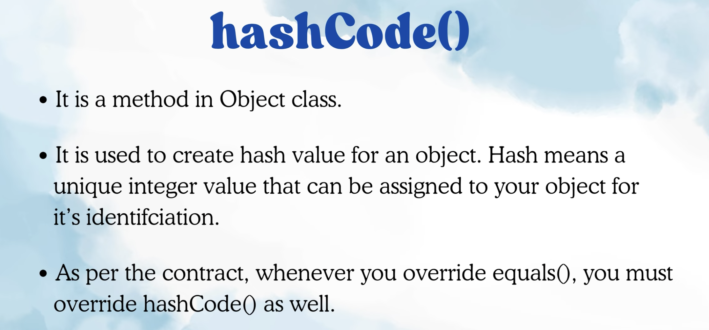

Equals vs Hashcode: 

-> Both mehthods belongs to parent class i.e Object.
-> In java all classess are child classes of Object.

See Employee and String example then custom implementation of equals.

HashCode() :

Earlier we have written equals implementation for Employee class and it was giving correct output based on our custom implemnetation then why there is a contract that if equals overriden then override hashcode method as well ?

There are some scenarios like in hashing based DS (Hash Set, HashMap etc)  methods internally uses equals and hasCode together.

let see in example.