Intenal working of HashMap:

-> HashMap is important DS
-> It works with key, value pairs.

Why HashMap is important ?
-> It can insert, search and delete all in O(1) Time complexity.    

HashMap can be be of any type: 
-> HashMap<String, Integer>
-> HashMap<Employee, Integer>

HashMap Internal Implementation: 

-> It is stored as an Array of Linked List.
-> Intital capacity of array is 16 and with every element of array you can store linked list.

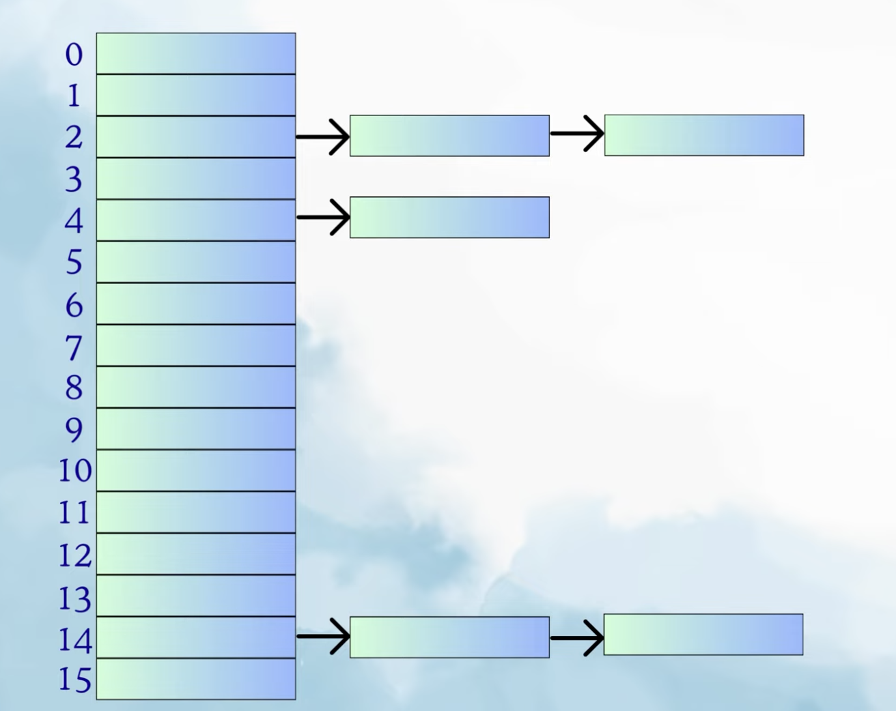

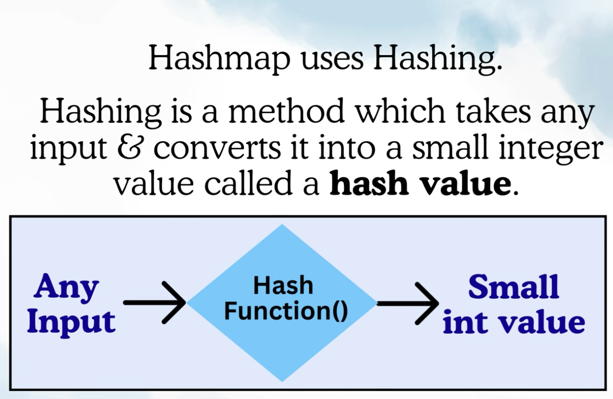

Hashing Rules: 
-> For the same input, you must get the same hash value.
-> Even for different inputs, you might get same hash value, its called hash collision.
-> Lesser the collision, better the hash function.
-> Different inputs should give unique output for better Hash function.
-> HashMap has its own hash method.
-> We can write our own custom hashing logic with key feature is that with your given input, it should return small integer value and this output should be unique for every input.

How it works let see:

We create hashMap using Key, value pair: 

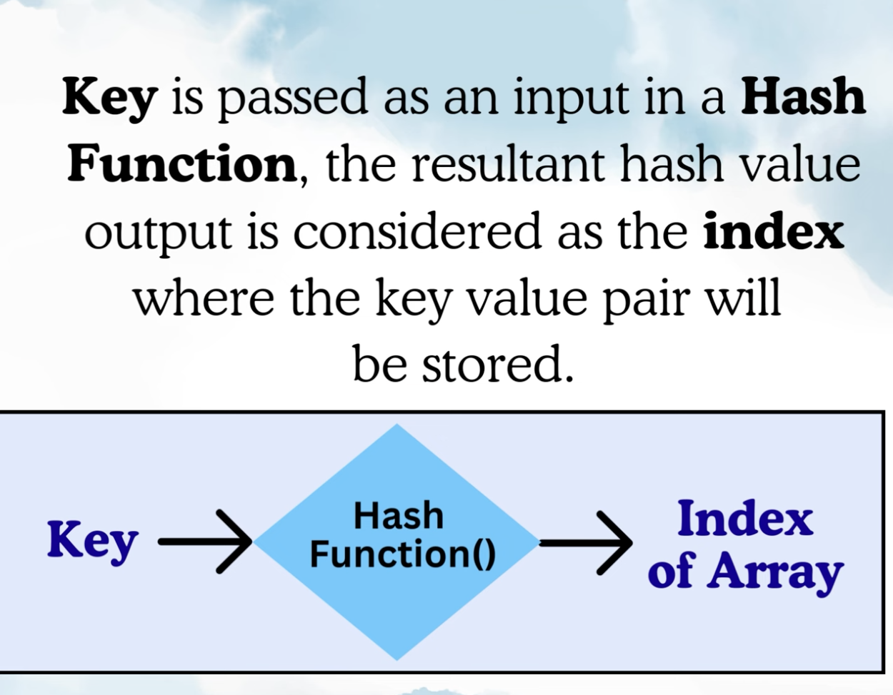

let see Ex: 
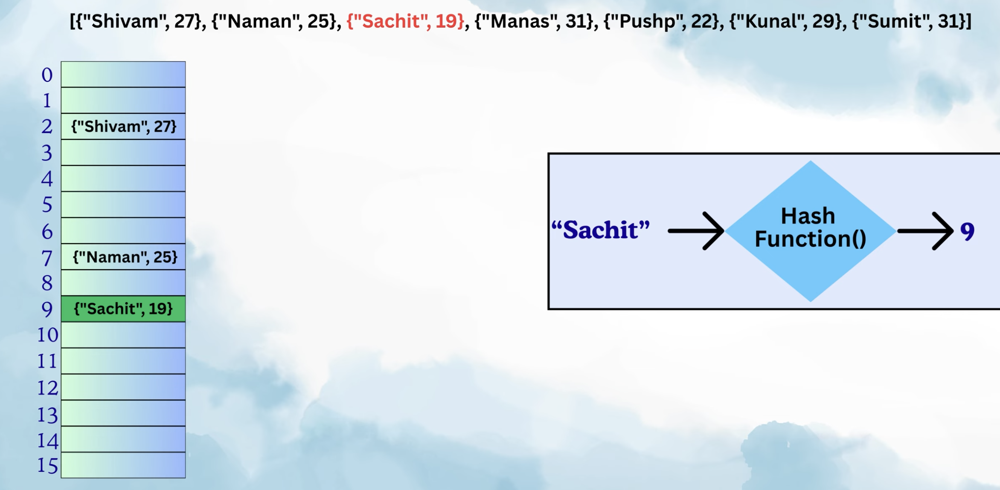

let see if we get collision, for a given input we get same hashvalue i.e. same index of an array:
Now actually the linked list mechanism going to take place when ever there is an collision

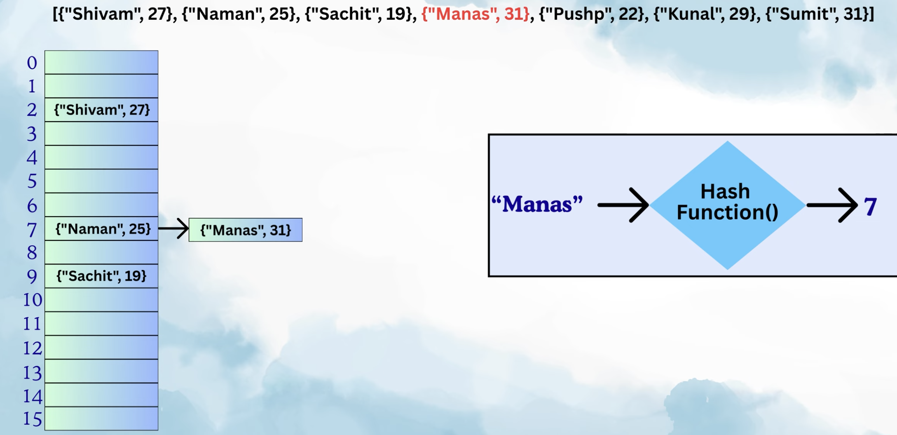

In Reality not many collisions takes place. HashFunction of hashmap has very good implementation.

How it got stored for complete hashmap example: 

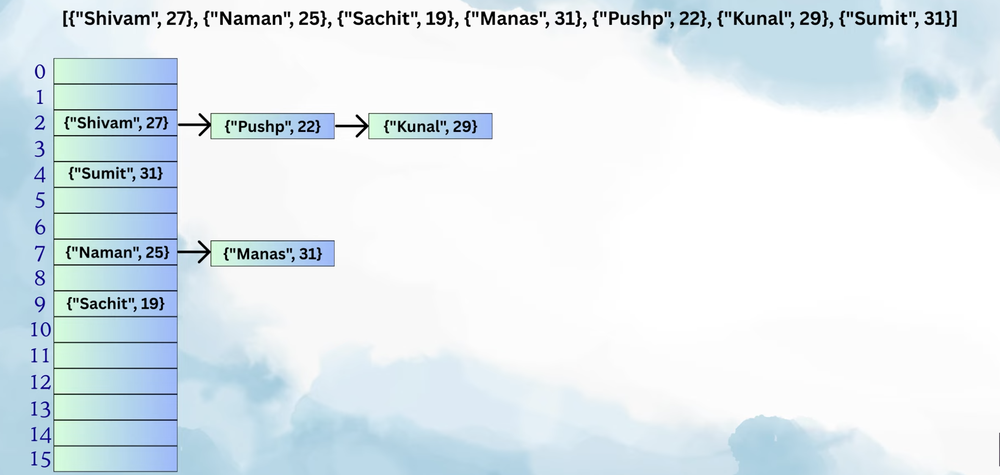

In Reality we directly do not store key, value in array we store addresses in the array, this key value is created somewhere in memory and those memory addressess we store in array.

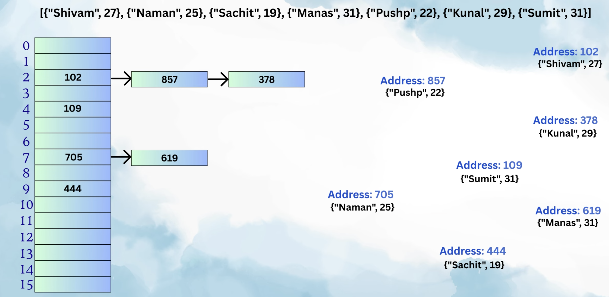

To Search, you can pass the same key to hashFunction and it will return the index and you can fetch it and same for Delete.

In case of collisions: 
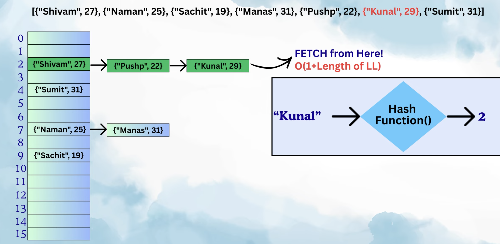

Since java 8, if there are too many collisions and length of LL becomes big then: 

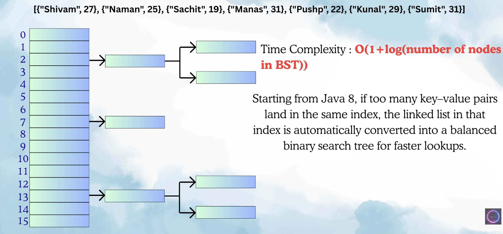

If we pass the same key to insert element then this is not collision it will go to the index
and replace the value
ex:

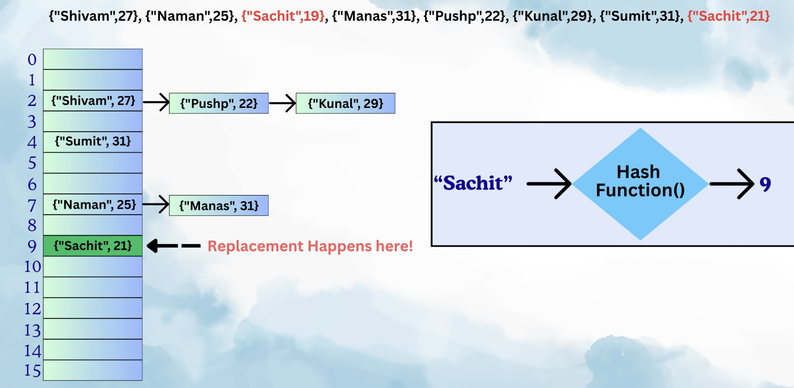

If same key is present but it is in linked list then first it will find arary index through hash function then will iterate over the list and check key present if yes then replace the value.

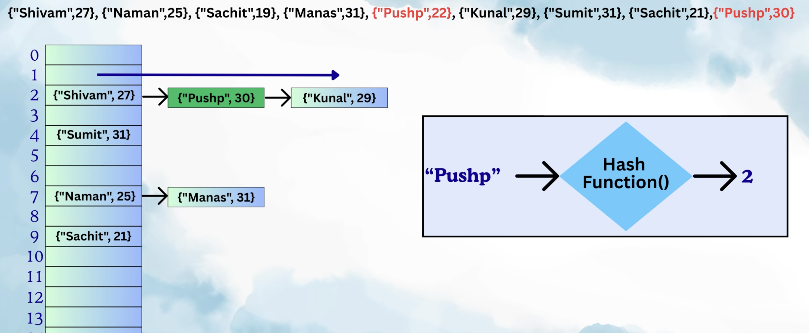

There are 2 methods that are into the play:
1. hashCode()
2. equals()

When does this equals method comes into play?
    -> When we are trying to add new Node and at that time there is already value present there so it matches the key, for matching it will use equals methods, if key matches then replace the value, if not then insert new Node.

