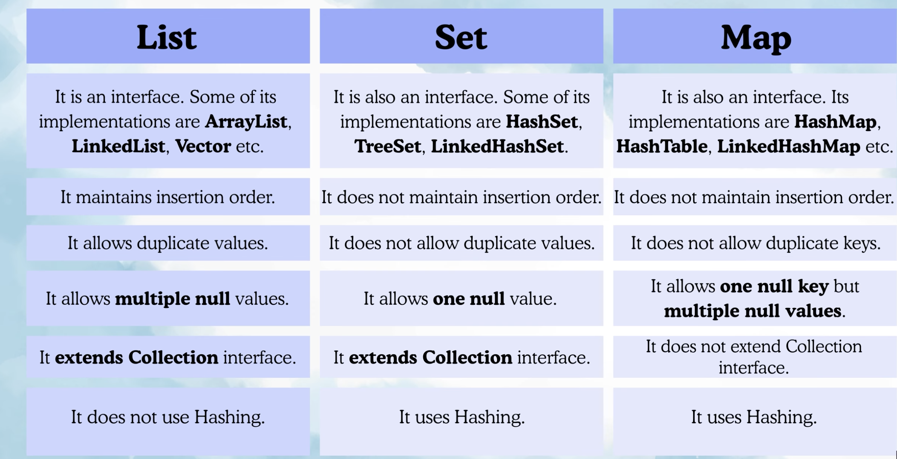
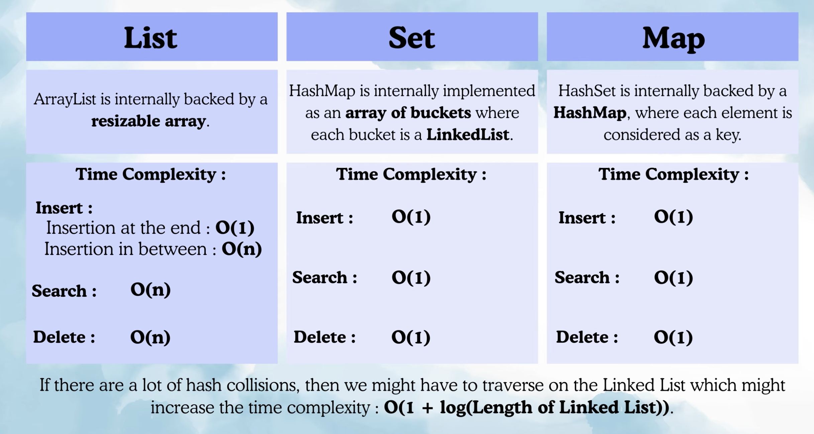
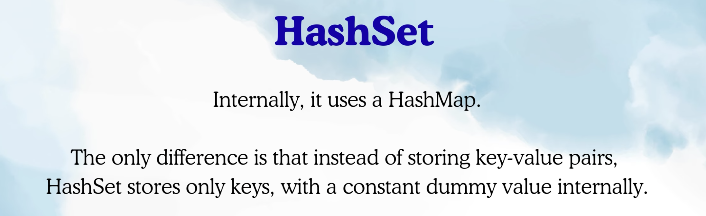

LIST VS SET VS MAP:

HashSet: 

Exceptions in insertion: 
In case of TreeSet stored in sorted order and LinkedHashSet exact order is manitained
similarly for TreeMap stored in sorted order based on keys and LinkedHashMap exact order is maintained.

