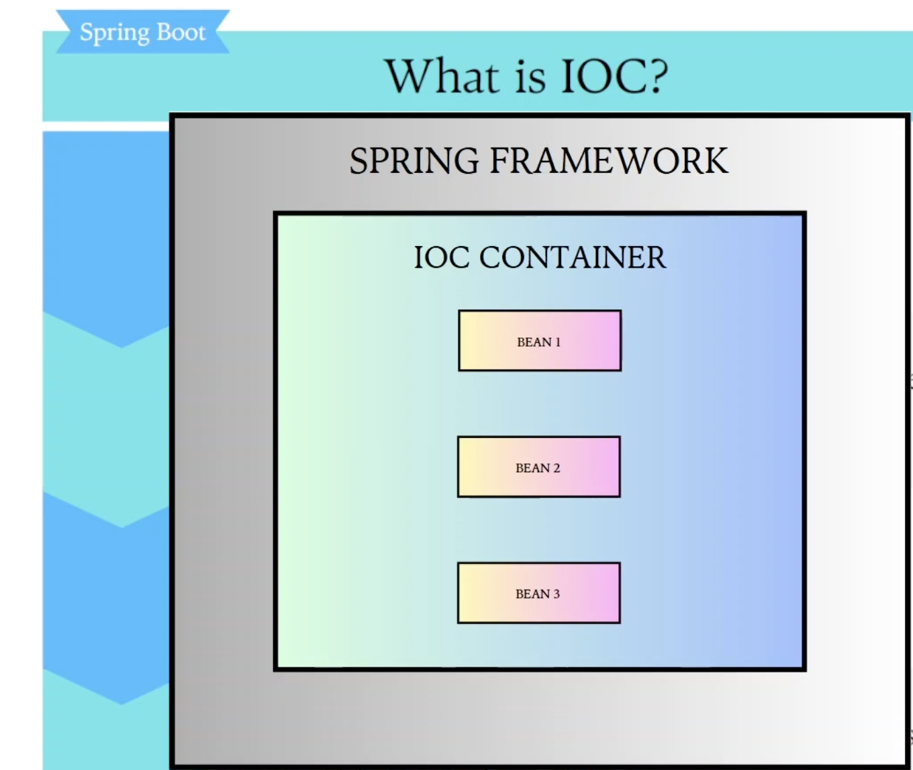
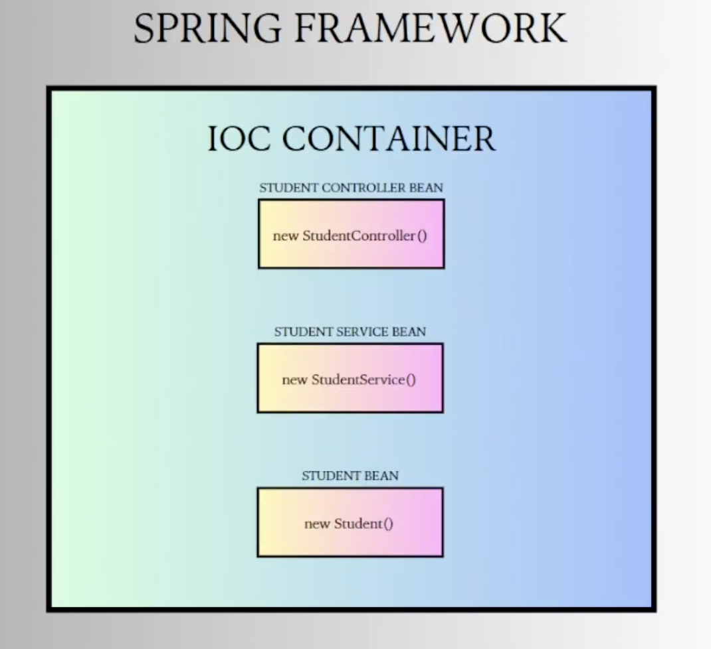

IOC AND DI:

What is IOC: 
-> IOC or INVERSION OF CONTROL, means spring can objects in form of beans.
-> There is no need to manually create object using new keyword.
-> Spring boot will take care of creating beans we just need to tell the spring boot these are the classes you need to create beans using annotations.

-> Spring Boot creates beans in IOC container.

-> These beans will be created in IOC.

-> Now these beans where we required can then be injected into the field of class using @Autowored annoation.

We created 3 classes but as soon as we run beans were not created, because we need to tell spring boot for which classes it should create beans.

IOC Contaier at start of application 

Dependency Injection Using Autowired.

Benefit:
We are not creating new object for every api hit, if beans and this concept was not present then for every api hit we would have created new object.
Let suppose in a day millions of api calls then it will hell lot of objects created in memory.
Using these beans and IOC container helps us to reuse the objects and like this is awesome, this is gamechanger that spring boot brought to us.

Use real world analogies  when explaining complex objects - it shows deep understanding.