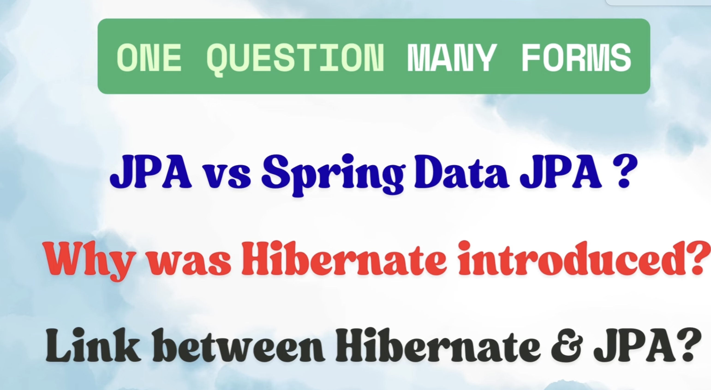

4 approches:
1. Spring data jpa
2. JPA
3. Hibernate
4. JDBC

@Entity: It tells spring boot that below class is representation of table.
@Table: maps java class to a specific table.
@Column: maps java field to a specific column of table.
@Id & @GeneratedValue: maps the java field to the primary key and @GeneratedValue defines its strategy (Primary key kis strategy se generate hoga.)

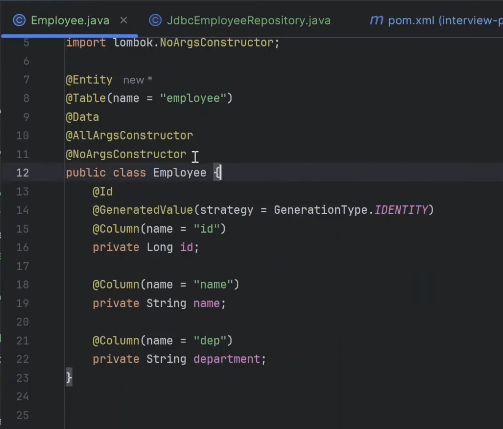

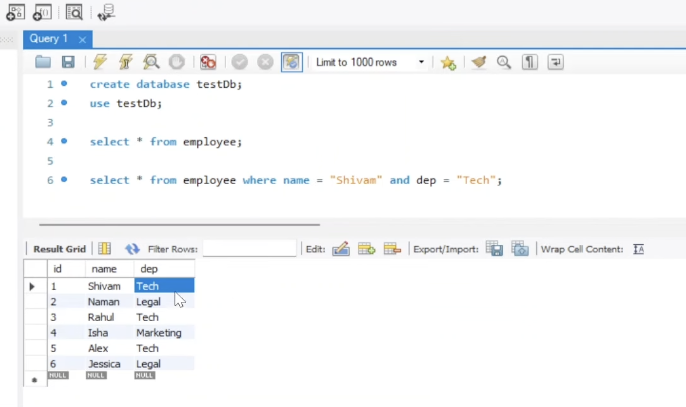

We added spring-boot-starter-jpa:
in this we have 3 dependency
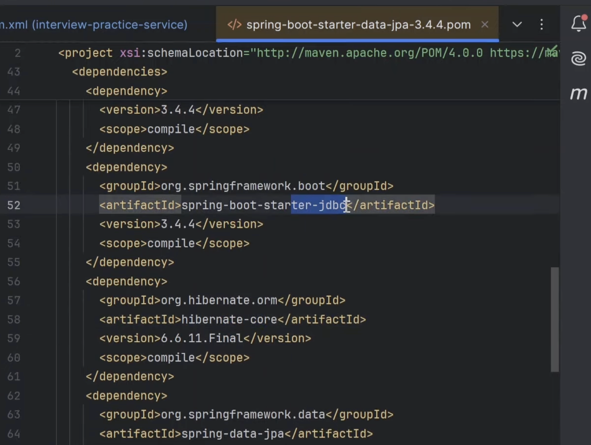

In hiberante core we have JPA dependency i.e. jakarta persistence api.

we have added application properties:

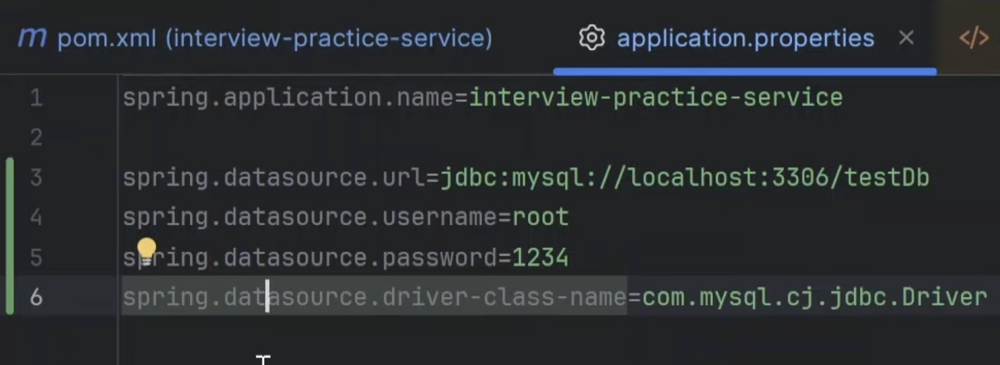

1. JDBC

-> when we use jdbc then actual sql ke naming used hogi.

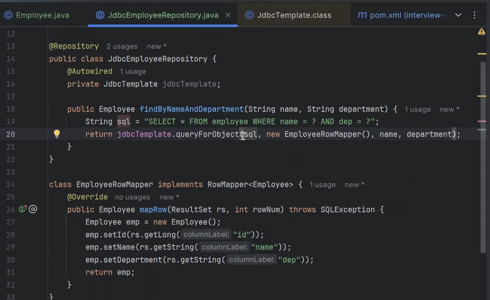

when we have already mapped field names to column and table on entity then why we need this mapper EmployeeRowMapper ?
Drawback of JDBC: JDBC do not use those annotations as these annotaions are part of JPA that is why hume explicity ek mapper likhna padhta hai.

That is why we avoid jdbcTemplate because need to write some boiler plate code and also Transaction management is not supported.

Code flow:
Service: 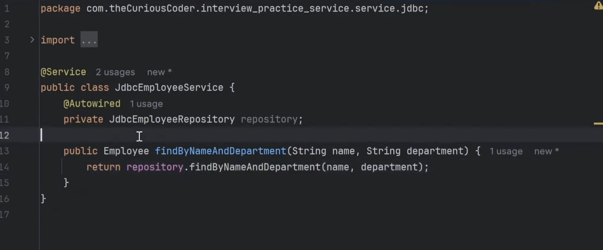
Controller: 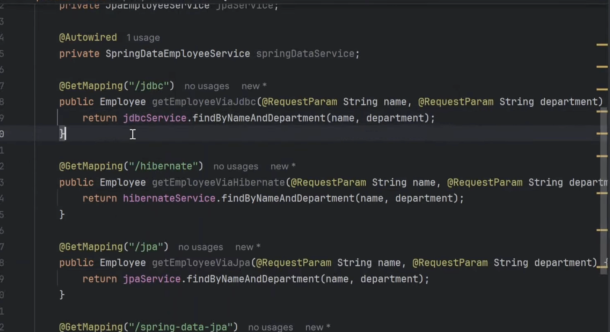

2. HIBERANTE:

-> it is an ORM tool 
ORM: Object relationship mapping: it is a technique that map java classes and fields with DB tables and columns.

JDBC is not an ORM tool, so ww have to provide external mapping manually.
Hiberante uses annotation that we provided on entity class. 
If you see those annoations comes from jakarta.persistence.* then how hibernate is able to use ?

-> Hibernate is an implementaion of JPA and hibernate ki dependency ke andar hi jpa ki dependency mili thi.

For hibernate we need to autowire SessionFactory.

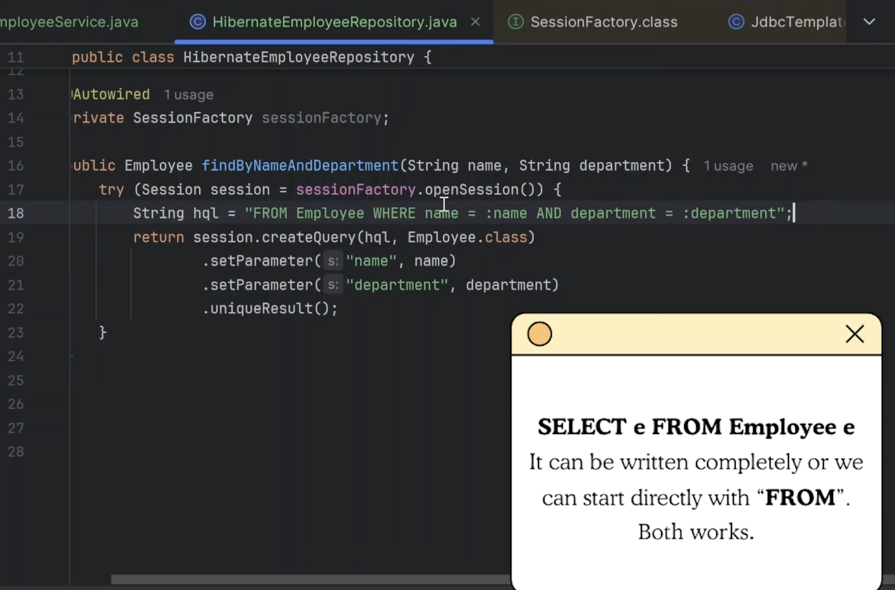

Here we are using java naming convetions na ki db ki, because hibernate uses those annotations.
Service code: 
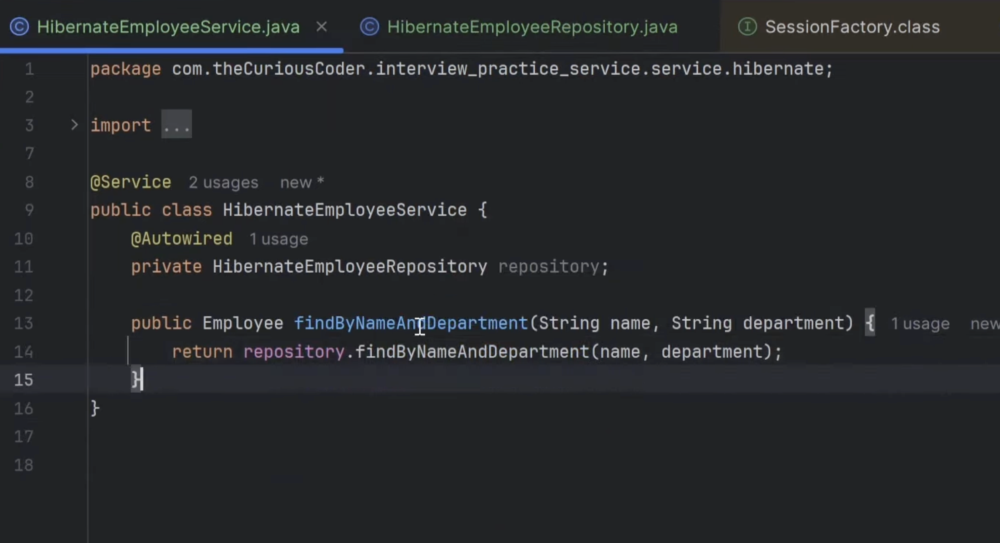

uniqueResult : because single hi result aana tha.

Hibernate drawback:
Like hibernate we have other orm tool: EclipseLink, MyBatis.

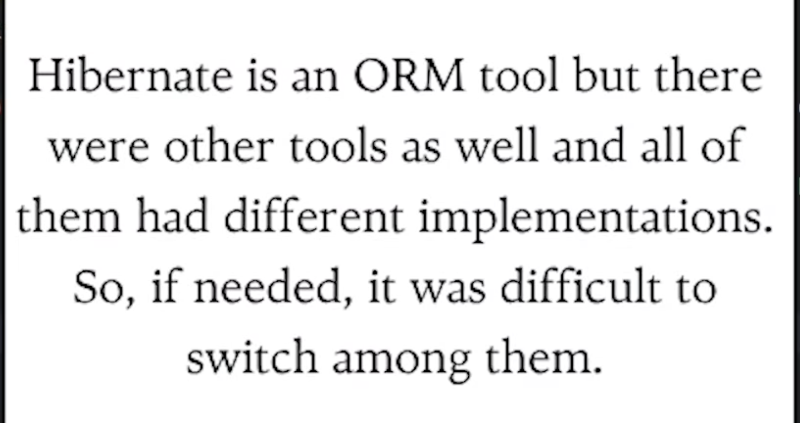

To solve this problem JPA was introduced.

3. JPA: It is a layer above all these ORM tools and that is why i said hibernate jpa ki ek implementation hai.

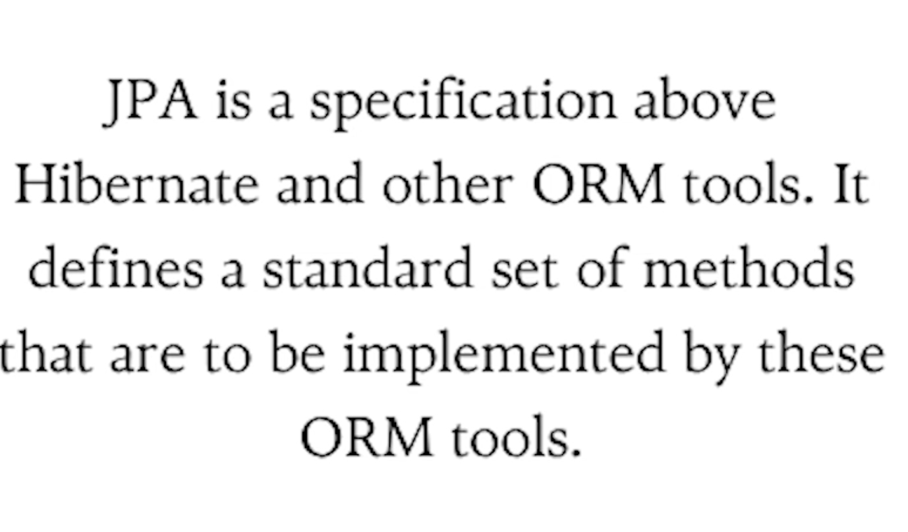

-> By default spring boot hibernate ko hi JPA implementaion manta hai.

-> As i said JPA is an abstraction layer above hibernate.
-> it is an interface layer.

Note: JPA and JPAREPOSITORY is different. (JPAREPOSITORY is a part of spring data jpa not core JPA)

Entity Manager is an interface that can be considered as JPA.

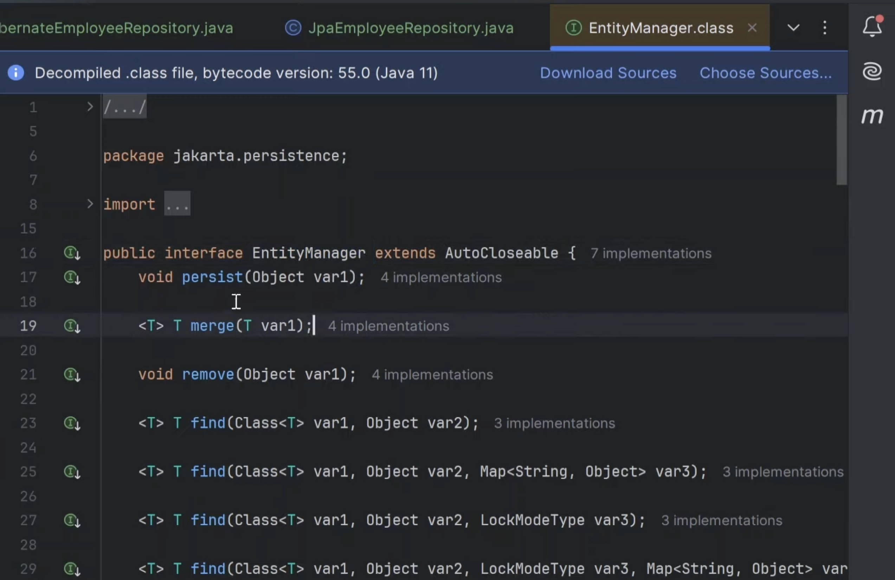

-> In methods ko SessionImpl implement kr rha hai which is a part of hibernate. So internally it is calling hiberante only.

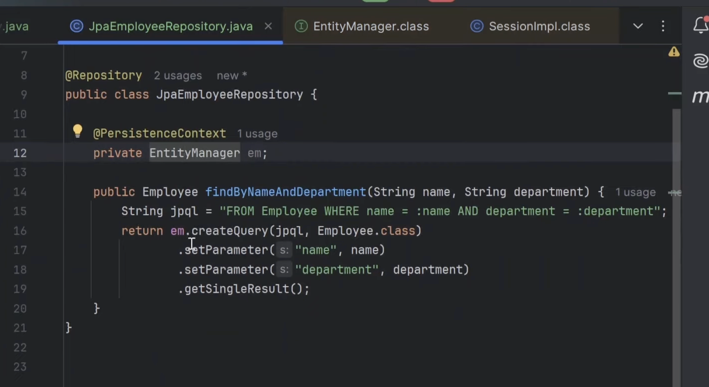

4. Spring Data JPA:
-> JPA me koi problem nahi thi.
-> SPRING DATA JPA se ek aur abstraction layer add krdi humne JPA pe which is spring data jpa module.
-> Spring data jpa is a module that is build on top of JPA.
-> Its a spring boot project that is introduced to reduce even more boiler plate code.

isse use krne ek liye hum interface bnate and usse extend krte JpaRepository<class, Primarykey Type>

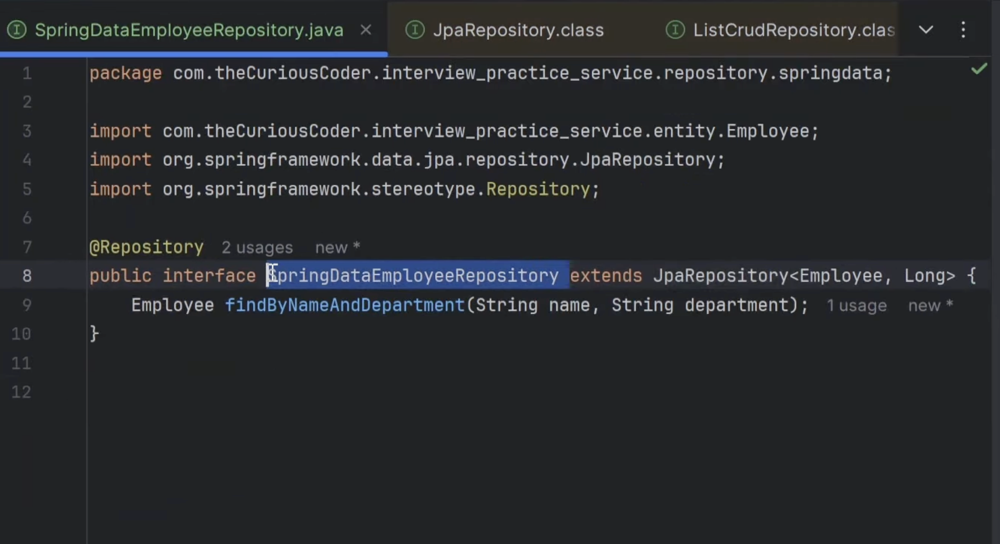

-> iss JpaRepository interface me jaaye tho isko SimpleJpaRepository implement kr rha hai jo ki internally EntityManager use kr raha hai.
Ye sab kuch internally hibernate hi use kr rha hai.

One beautiful concept it gives is Derived Queries:
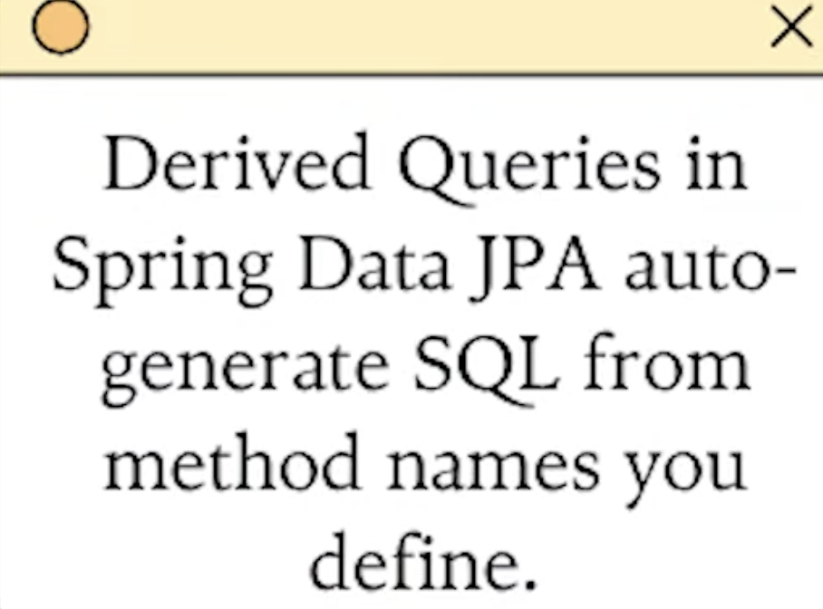

Service Code:

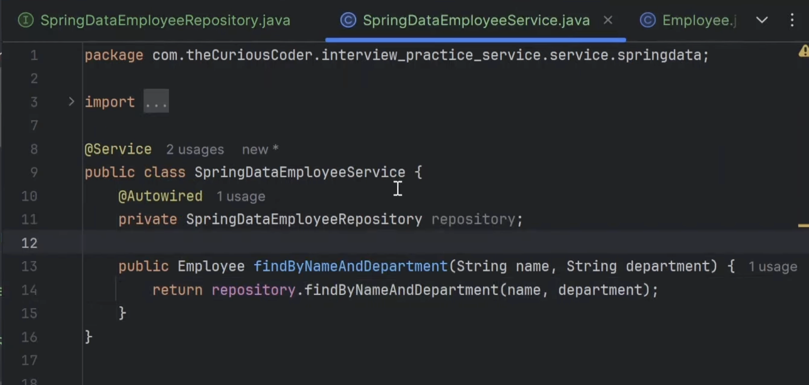

koi session open ki zarurat nahi, koi createquery method krne ki zaruat nahi, kuch query likhne ki zarurat nahi.

