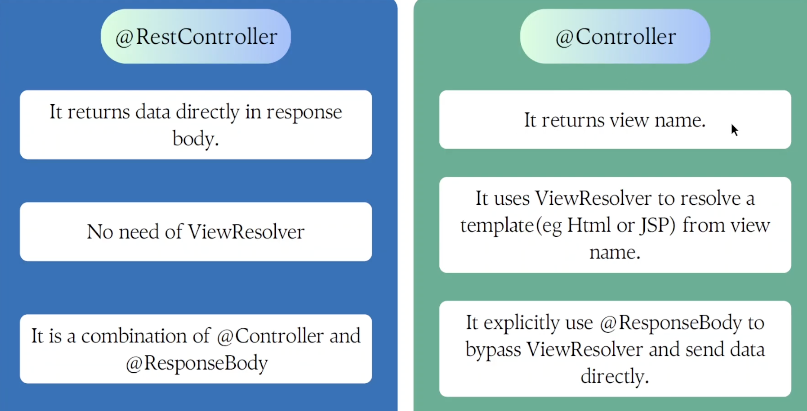

REST CONTROLLER VS CONTROLLER:

Misconception: 
-> RestController is used for JSON response 
-> Controller is used for HTML or JSP response.

This is wrong in controller also we can retun json response.

Actual difference: 

In Rest Controller we have returned String it will consider as a data.
But in case of controller it will consider Himanshu not as data but as a view name.

Views: These are templates that we can define to send in response.
ex: HTML, JSP or any other format or it can be Json.

Ex: dev when hit got 500 in error it told template not resolved.
Ex: Can create JSON view as well.

-> In Controller there is an interface ViewResolver that maps view names that is returned by controller to actual view files.

Note: @ResponseBody is used with @Controller, it will by pass the ViewResolver and it will not consider it as a view it will consider as a data.

Controller ke saath explicitly ResponseBody use krna padhta tha tho so RestController came.

