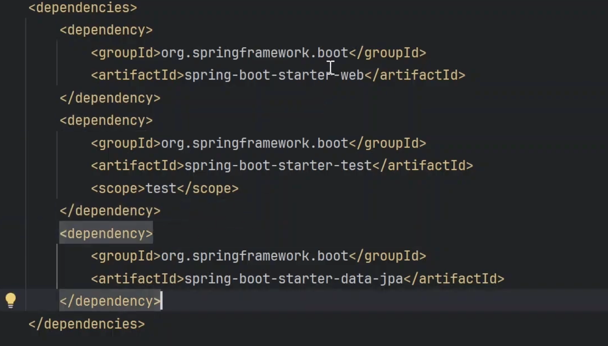
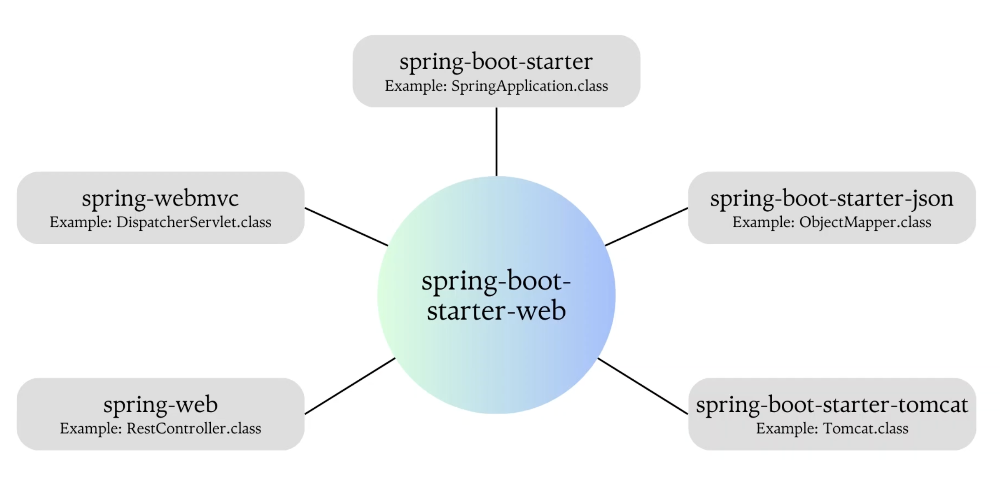

SPRING BOOT STARTER DEPENDENCIES: 

-> It is introduced by spring boot to make developer life easy.

-> Multiple dependencies are clustered into one starter dependency, which helps to manage pom.xml

-> Earlier we need to add lot of dependencies and those dependencies should be compatible to each other which was huge task due to their version assoicated with it, because we need to make sure that we are adding correct version of the dependencies, now spring boot starter dependencies concept helps to manage pom.xml easily.

Examples: spring-boot-starter-web (have all dependencies which spring boot requires to start the application), spring-boot-starter-test (for writing junit cases), spring-boot-starter-jpa for db.

spring-boot-starter-web: 

Isme bhot saari dependency hai which helps to start the application and bhot important classes provide krti hai:

mvn dependency:tree to see the dependency tree in terminal or can see in idea.

Just with one dependency hume ye sari classes mil rhi hai and this is the benefit of this starter dependency.
Ye saari dependency ko club kr deta hai and aapko all those classes mil jaati sirf ek dependency add krke.

ObjectMapper: Used for serialization and deserialize.

json to java object or java object to json 

Tomcat: Spring boot hume embedded servers deta hai and by default it is tomcat.

Already created video for dispatcher servelt will see later.

