Spring Boot Over Spring:

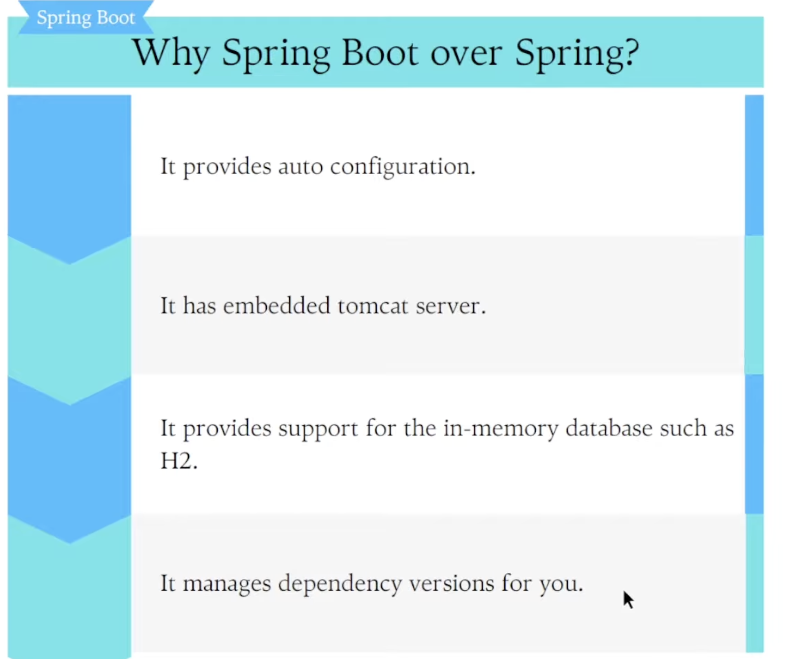

Auto Configuration:
-> Spring boot will create auto configuration classes for you, you do not have to create them manually.
ex: Database configurations, Tomcat server configuration, Dispatcher Servlet configuration.

Spring boot starter web hume bhot important jar file deta hai i.e. spring-boot-autoconfigure jar that contains the code for auto configuration mechanism.

In this jar we have all auto configure classes.

Database Related Autoconfiguration classes: 
ex: JpaRepositoryAutoConfiguration class, DataSourceAutoConfiguration class etc.

Note: JPA is java persistence api that defines how to interact with database using objects and methods without writing sql query.

AutoConfiguration annotation on top on this class: This tells spring that you need to autoconfigure this class.
This means iss class me kuch methods hai usme @Bean annotation hai, i.e. ye bean bnayega and will put it in IOC container and these beans will be required when we want to work with JPA. Just understand that to work with JPA u need certain things which it will provide.
ex: EntityManager interface hai like JPARepository which is used to write complex queries and interact with database objects and classes. So we need this so this bean will already be present in IOC as during auticonfiguration this bean was created. Spring boot has already wrtten this so that we do not need to write this. Issi tarah bhot saari classes and methods chaiye evnetually JPA to work jo autoconfiguration ke through mil jaati.

AutoConfiguration annotation spring boot ko btayega that you need to see this class and iss class me jo bhi beans defined hai, wo beans jab project start hoga tho create krke IOC me rkh deni hai

@ConditionalOnBean
@ConditionalOnClass({JPARepository.class})
Auto configuration tho krna hai but kuch conditions ke upar krna hai matlab ki har baar auto configure nahi krna hai ye class.
This means agar JPARepository milti hai tho hi JpaRepositoryAutoConfiguration class ko autoconfigure krna.

Note: Spring Boot autoconfigures based on the dependencies you add in your class path. it does not autoconfigure everything.
Agar me POM me below dependency add krta hu, tho jab bhi project start krenge tho ye class ki auto configuration ho jaegi because @ConditionalOnClass({JPARepository.class}) ye true ho jaega.
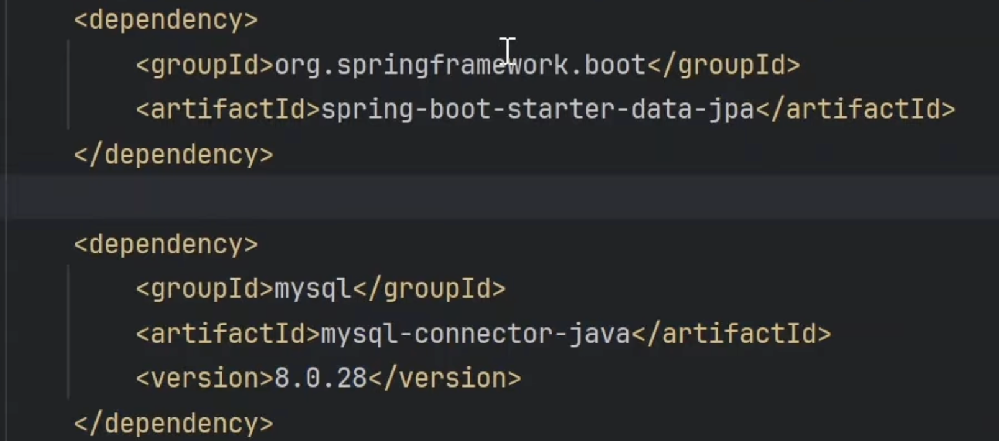

Summary: Kuch configuration classes hoti hai unpe hum @AutoConfiguration lgate hai and unn classes ko configure krne ke liye kuch conditions bhi define hoti hai and when this conditions are satisfied then only we will configure these classes. 
Configure krne ke liye hum kya krte hai hum kuch classes ki bean bnake rkh deta hai by using @Bean in IOC jo ki JPA ko required hogi for its internal working.

ex: DataSourceAutoConfiguration: 
This is required for data base connection
In this also:
@Autoconfiguration
@ConditionalOnClass(DataSoruce.class, EmbedddedDataType.class)

@EnableConfigurationProperties({DataSoruceProperties.class})

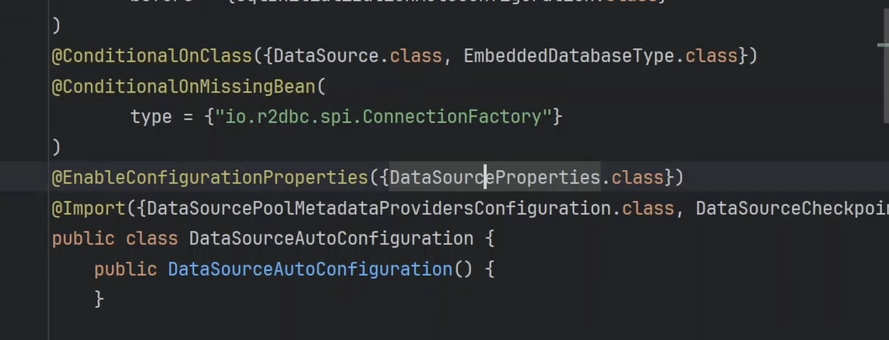
This class DataSoruceProperties

ye class me if you see we have 

@ConfigurationProperties
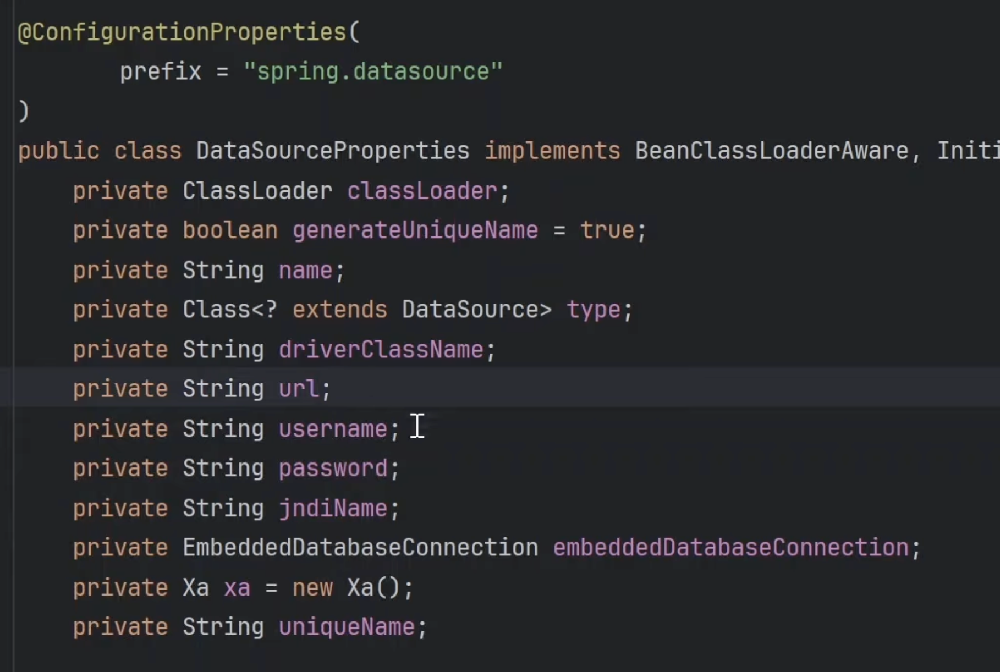

ye class expect krta hai database ke connection ki details which we provide in application.properties.

@EnableConfigurationProperties: ye annotation kya krti hai ye application.properties se values legi aur map kr degi DataSoruceProperties ke field me.

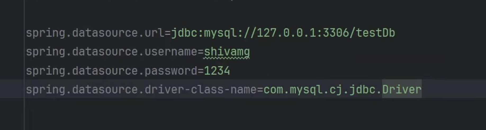

Summary: 
Just think like that jo details aapne di application.propeties wo saari details IOC container me apne aap chali jayegi jaise hi DataSoruceProperties class ki bean banegi and aapka DB connection apne aap ban jayega.

So these 2 class  examples for databaseAuto configuration.

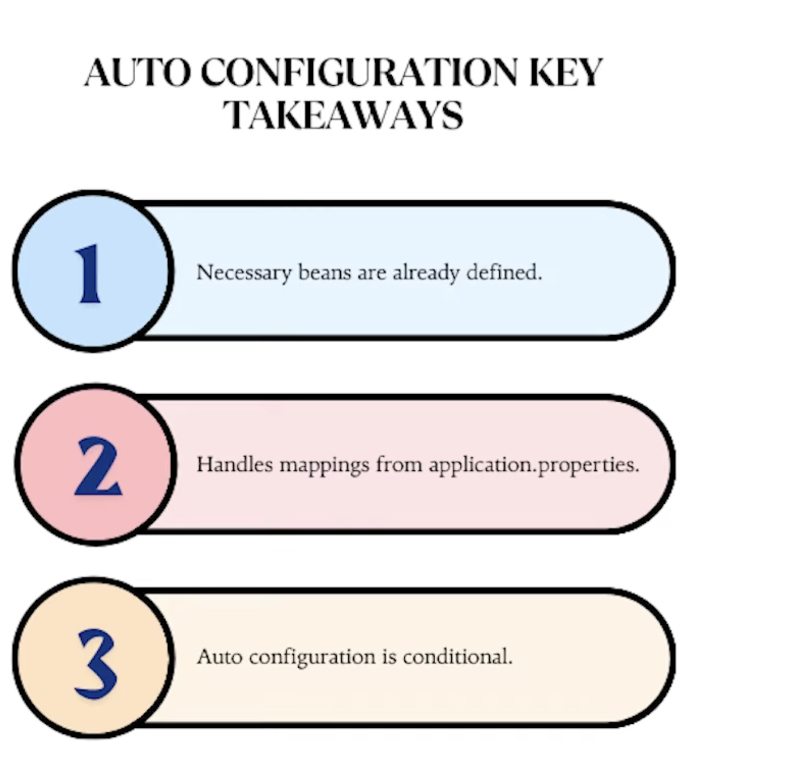

DISPATCHER SERVLET CONFIGURATION:

Spring me hume ye class khud configure krni padhti hai but spring boot has already done this for us.

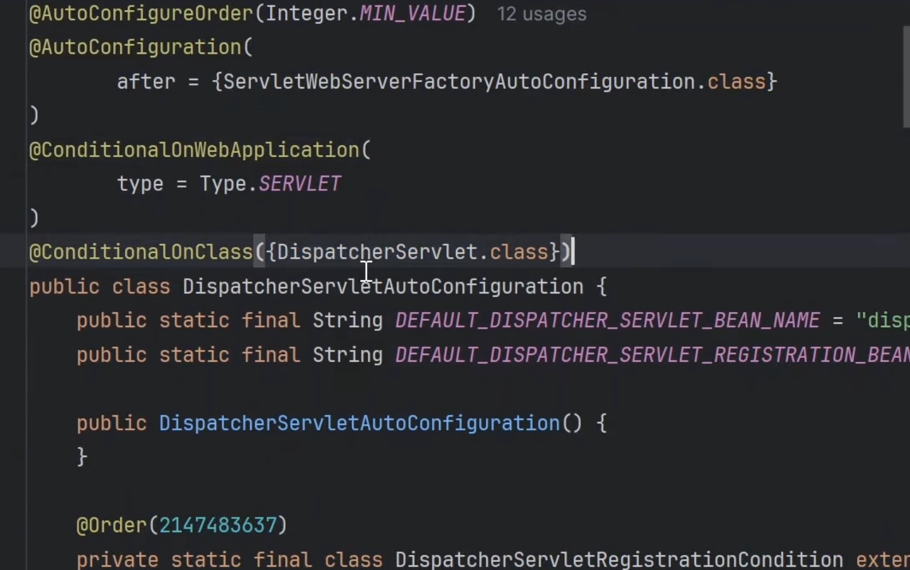
Iski condition ye keh rhi hai ki Dispatcher servlet ki class ho.This class is present kuki spring-boot-starter-web me ye hoti hai.
Isko jo bhi classes chaiye rhegi uski bean ye khud hi ban dega using @Bean which u can see is present in this clas as well.

Tomcat ki bhi configuration classes hoti hai. (Tomcat is a by default server on which our application runs).

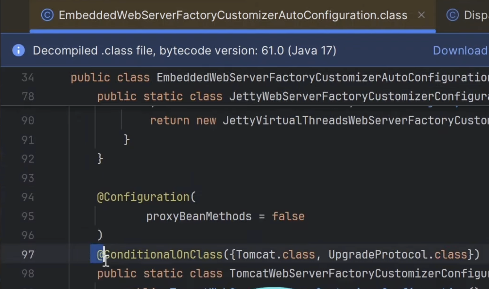

EmbeddedWebServer class hai isme condition lagayi hui hai ki Tomcat.class hogi tho autoconfigure kro.

Tomcat ki class already defined hai spring boot me 
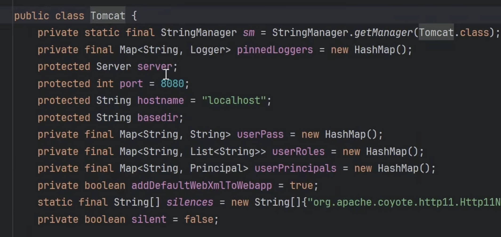 
This brings to the second point that spring boot has embedded tomcat server.
Spring boot khud se hi aapko server de rha hai, khud se hi wo configure kr de rha hai that is why spring boot is stand alone application. As a developer you just need to add dependencies in pom.xml

We added spring-boot-starter-web: given autoconfiguration classes, dispactcher servlet , tomcat classes.
when we need to work with jpa and db connection added spring-boot-starter-jpa and connector and given details app.properties details.

It provides Support for inmemory database such as H2.
Till now we were connected to external database i.e sql.
we can use inmemory data base 

add this 
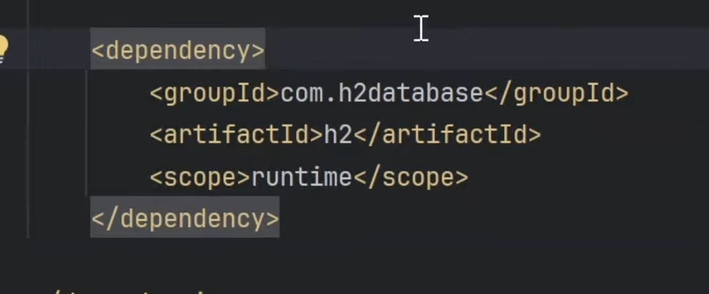

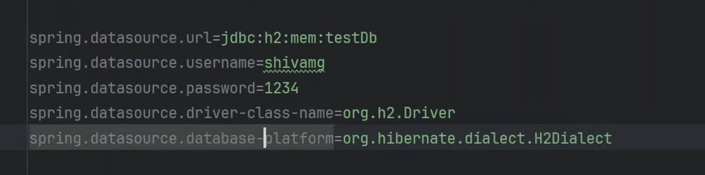

mem means in memory
testDB : default schema.

Console pe dekhne ke liye ye add kro 

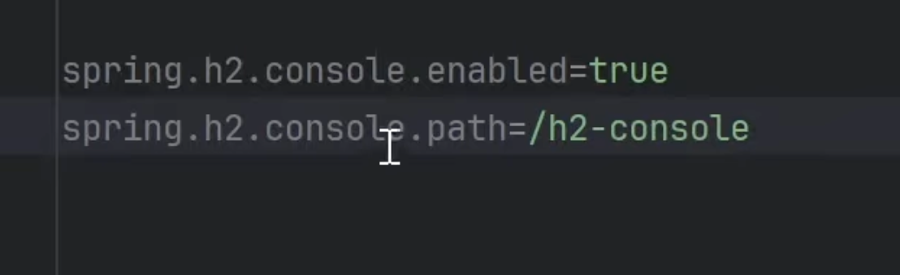

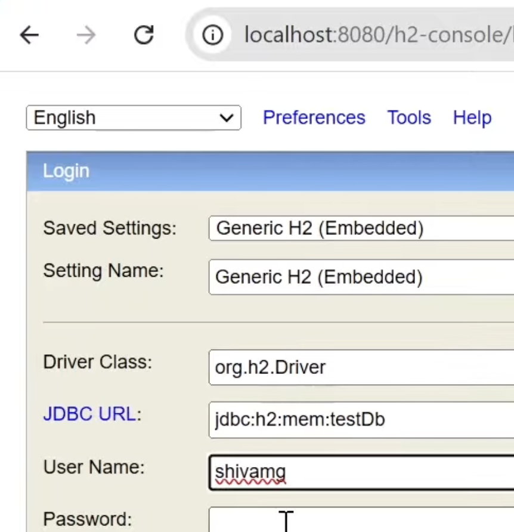

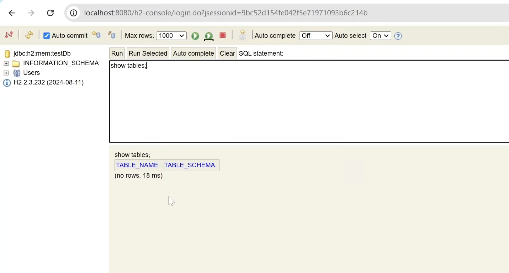