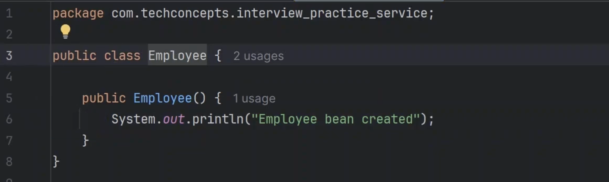
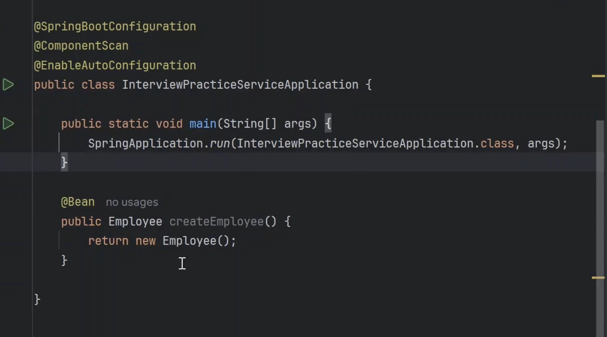
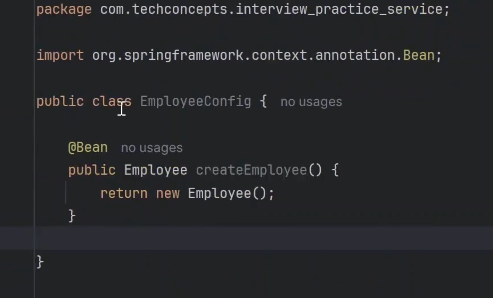
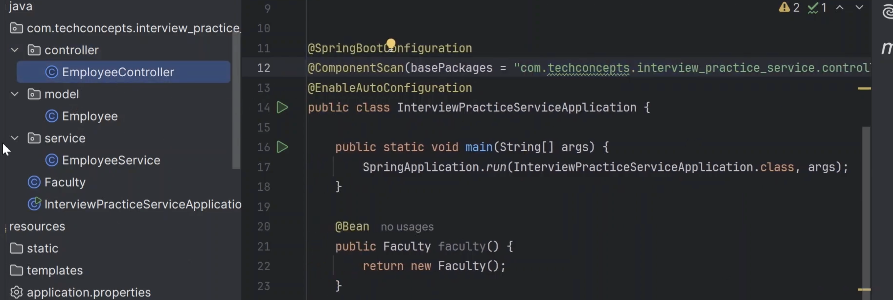
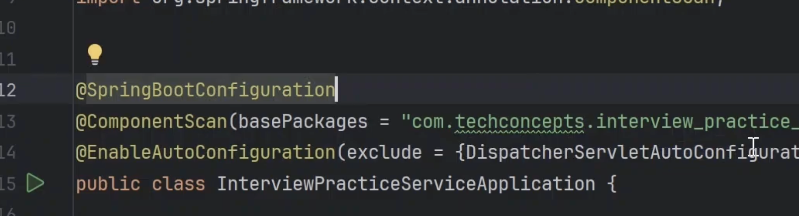
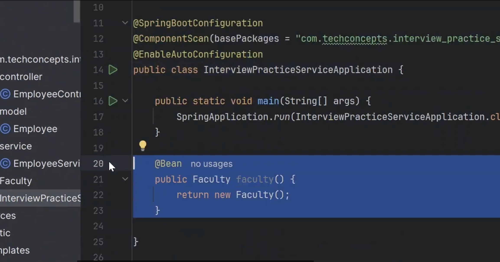

@SpringBootApplication:

-> It is used on class level and used on class where we run our spring application (main method wali class).

-> It is combination of 3 different annotations:
1. @SpringBootConfiguration 
2. @EnableAutoConfiguration
3. @ComponentScan

All these 3 annotations are used to create beans only but perspective thoda different hai.

@SpringBootConfiguration:
    -> when ever you put this annotation on class, you make that class is source for bean declarations.
    -> You can declare beans on that class.

    -> You can create bean either using @Component on class but you can also create using bean

    
    -> Employee class created, now creating Bean:

This will create bean of employee.

    -> Now lets create another class EmployeeConfig and move that method to this class

    -> No bean created, because we did not add @SpringBootConfiguration 
    -> After adding bean got created.

   

@ComponentScan: When we start project, this scans your project and looks out for delcared beans and create those beans in the IOC.

 -> SpringBootConfiguration: this is saying you are putting this annotation on class, you are allowed to declare a bean inside a class.  

 -> But actual me wo bean ban kb rha hai, mera project run ho rha hai and componentscan pure project ko scan krta hai and wo kya dekhta hai ki aapne @Bean annotation lgayi hui thi and uski bean bna deta hai.

This is the basic difference.

 -> SpringBootConfiguration allows you to declare the beans and componentscan scans the project and create those beans at the time of running app.

 -> ComponetScan basically scans down the package and subpackages and it will look out for annotations that are responsible for bean declarations: (@RestController, @Component, @Service, @SpringBootConfiguration: iske andar @Bean ko dundhta etc )

 -> In Component scan we have a concept of basePackages = "".
 -> 

 -> It will create of controller class and Faculty and will not create beans for service and model as it will scan only controller package.
 Note: Faculty ki bean isliye bani kuki componentScan main class ko scan humesha krta

 @EnableAutConfiguration:

 This tells spring boot to enable its autoconfiguration mechanism. 

 This tells spring boot that which all configuration files you need and create those beans on project start up.

 we can exclude some configuration also
 
 this will fail the project to run  as spring boot need this class.

 -> Humne khud se bean declare ki this Faculty wali, becauase we needed this
 

 -> Issi tarah humare project ko start hone ke liye bhot saare beans chaiye hoti and aap jaise jaise depenedncy add krte ho, you need more beans, spring boot unn beans ko khud se declare kr deta hai, jitni bhi autoconfiguration classes hai umne beans ki declaration hui hai and auto matic configure hai, jab project start hoga tho beans create ho jayegi.