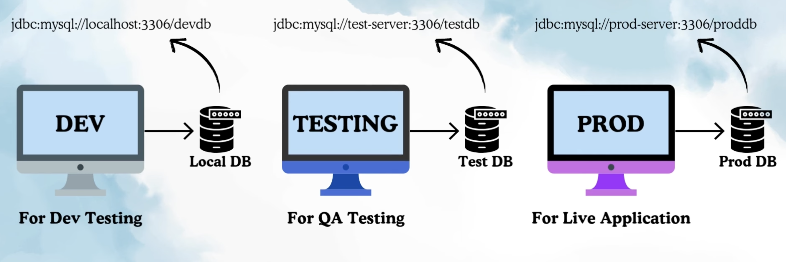
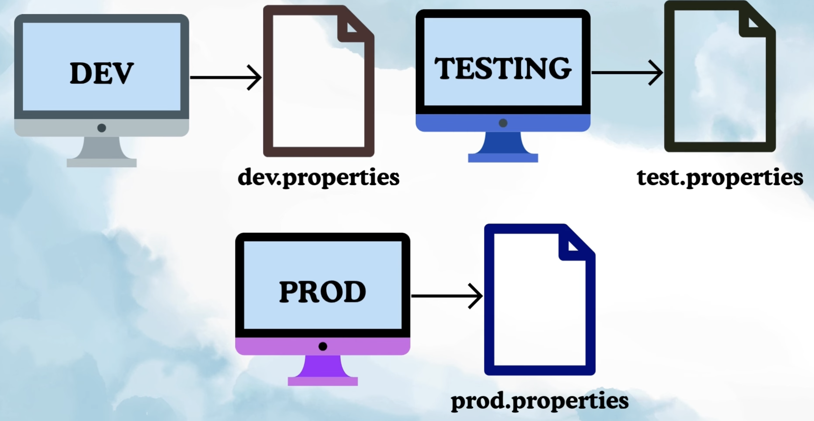
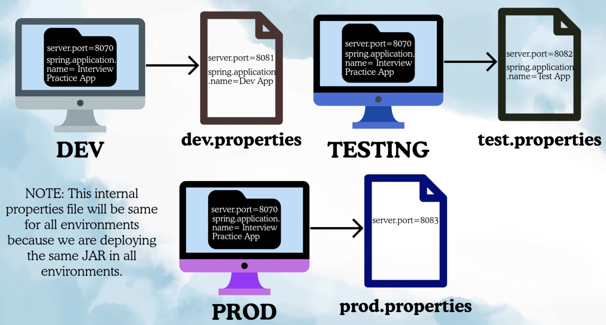
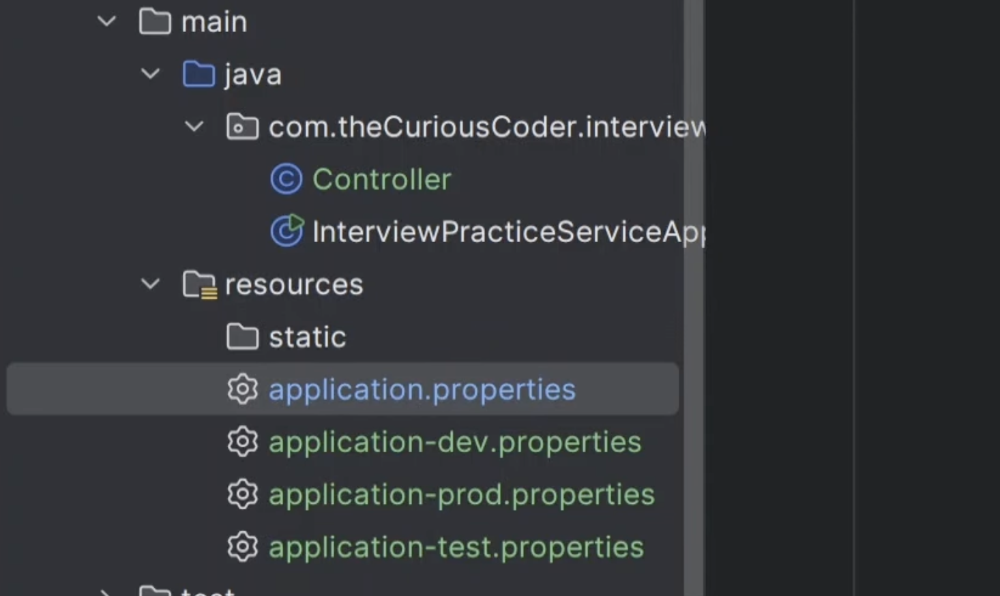
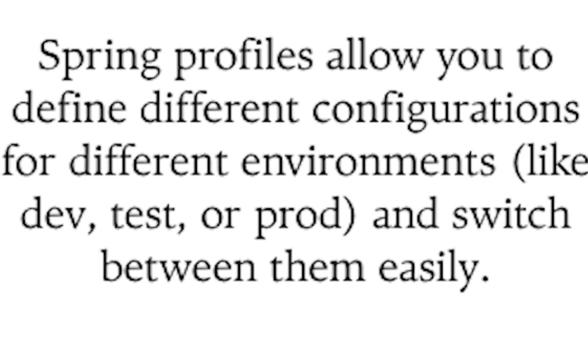
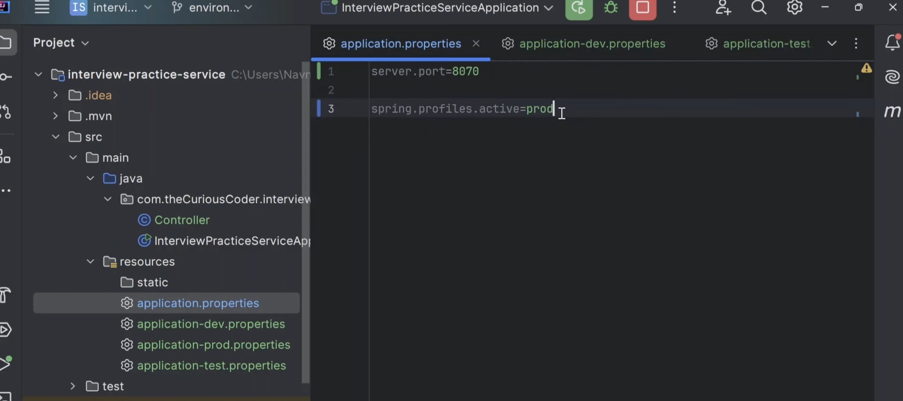
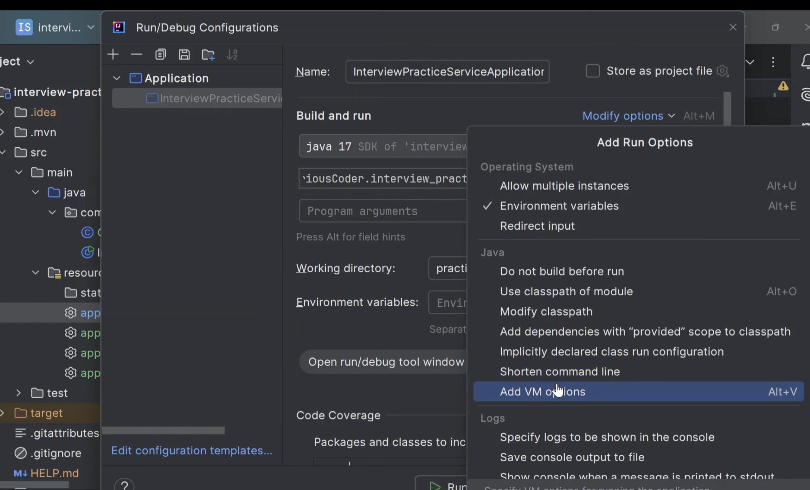
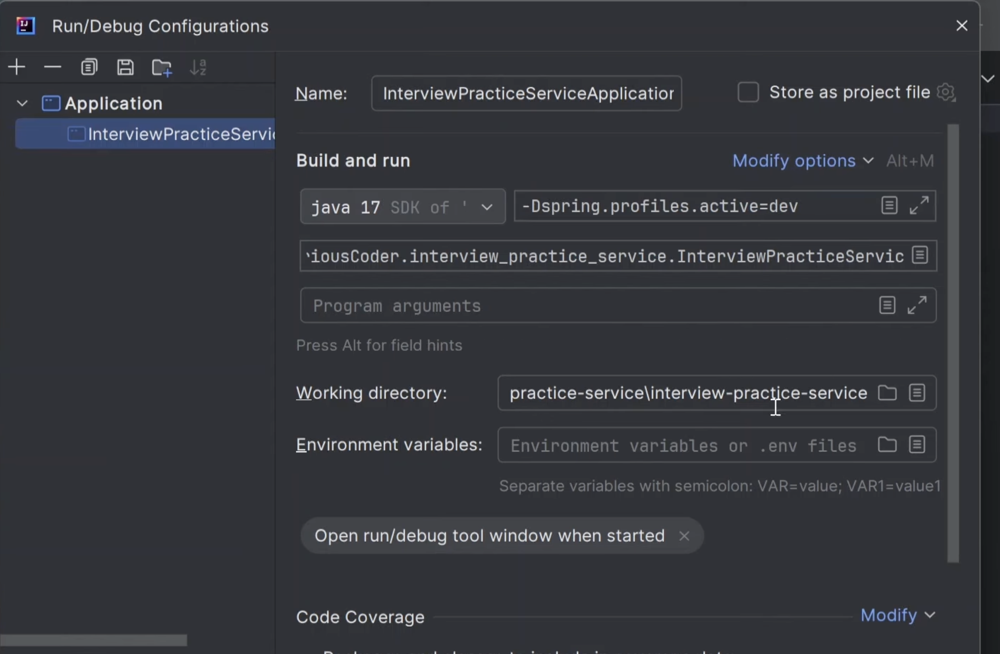
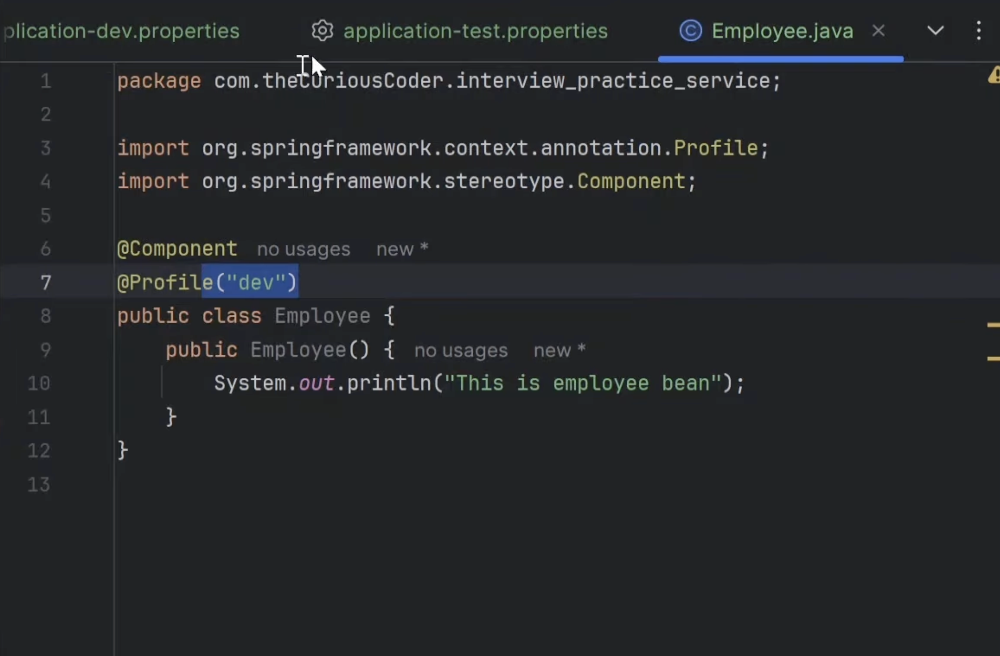

Need for Enviroment Properties:

Ex:
You cannot hard code db properties for dev and use it for test and prod.

That is why environment specific configuration is required.

So, we have to provide environment property for db url, it will be key-value pair.
key will be constant and value will be keep on changing based on the environment.

There are 2 ways to configure environment properties:
1. application.properties.
2. application.yaml

Basically what we want is we want different values for one key

There are 2 ways to do:
1. External: 3 different files for 3 different env and will place at some specific location and my project will read from it.
2. Using spring profiles.

1. External Properties file:

what happens to internal application.properties file ?
That file will still be there, its just that this file will be overriden.
if properties are present in both external and internal file then external one will take priority.

If external file do not have property then spring boot will take the key-value from internal file.
ex: in prod name of application it will take from internal file.

How to tell spring boot to use external file ?

While running spring boot application, we pass cmd line arguments with location of file.

Drawback wit this approach: 
-> somone replace the file
-> someone modifies the file's  data and it affects the running application. 
human error can take place.

How to avoid this ?
-> keep all config files inside our application and configure the app in such a way it read it from inside.

Again you can say someone can change it and make human error. But our app goes through multiple testing so error persists then can be caught.

Spring profiles:
Keeping all files in application itself.

How to tell spring boot which profile is active ?

-> In application.properties we give:
    spring.profiles.active=prod

    prod will be active.

we can enable multiple profiles at same time:

spring.profiles.active=prod,test,dev

dev will have most priority and prod will have less priority.

Instead of hardcoding in properties file, i want it dynamically:
we should use cmd line arguments while running the application instead of hardcoding like this:
spring.profiles.active=prod,test,dev

in intellij:

Profile Annotation:
@Profile: It is used to activate beans only for specific environment based on active profile.
ex: create this bean only on dev not on test and prod.

Bean will only be created if dev profile is active.

we can configure it for multiple environments: 

@Profile({"dev", "test"})

if any of dev or test is active then Employee bean is created.
