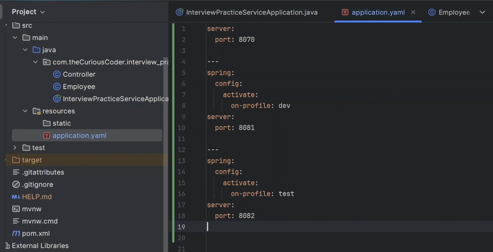

Why do we need application.yaml file ?

1. It supports heirarichal structure and it is indentation based.

How it is helpful ?

Let say to write db properties: 

in yaml same will look like:

In a large project we might have been scattered these properties in different places far apart from each other , but in yaml all the similar properties are grouped hierarchially under one block, so it easy to manage all the properties.
Ex:

2. Using yaml file I can do all in single yaml file, All spring profiles are defined in a single file i.e. application.yaml
i.e. we prefer application.yaml over application.properties.

Similar way through cmd line arguments we can tell which to activate 

NOTE: Hierarchy must be maintained in application.yaml

