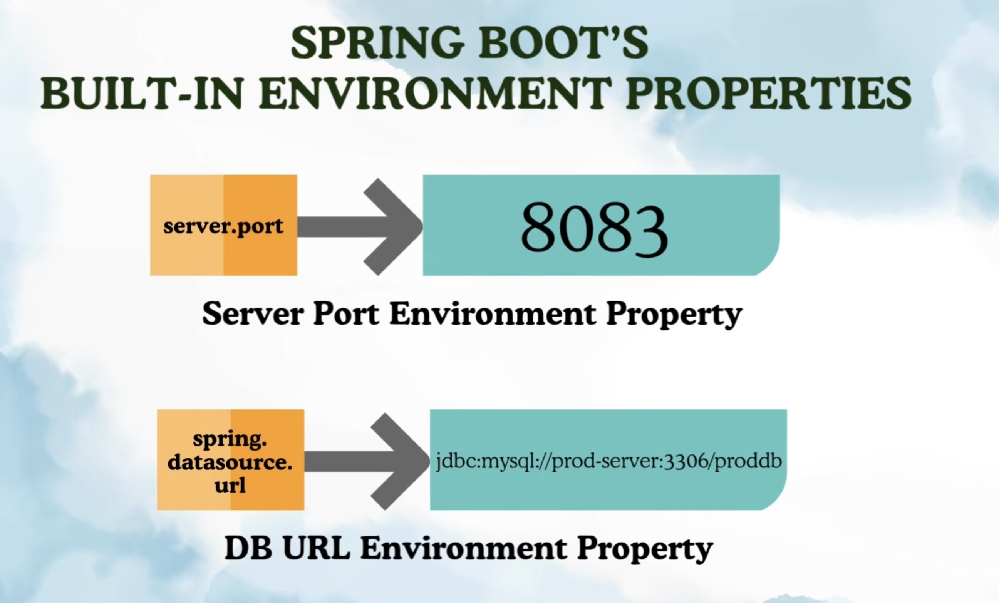
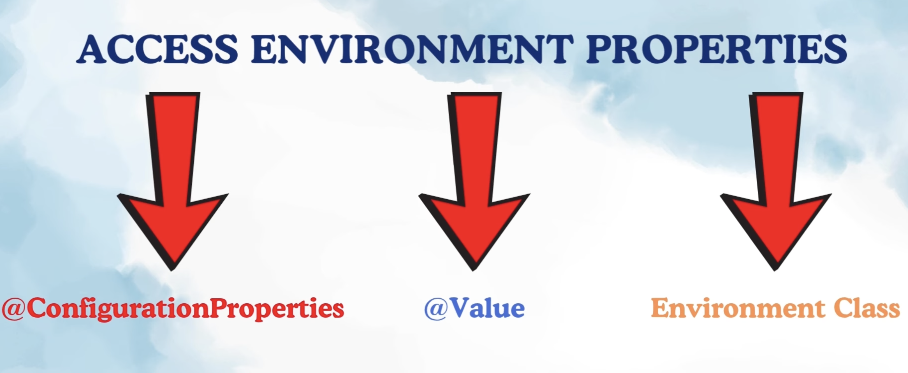
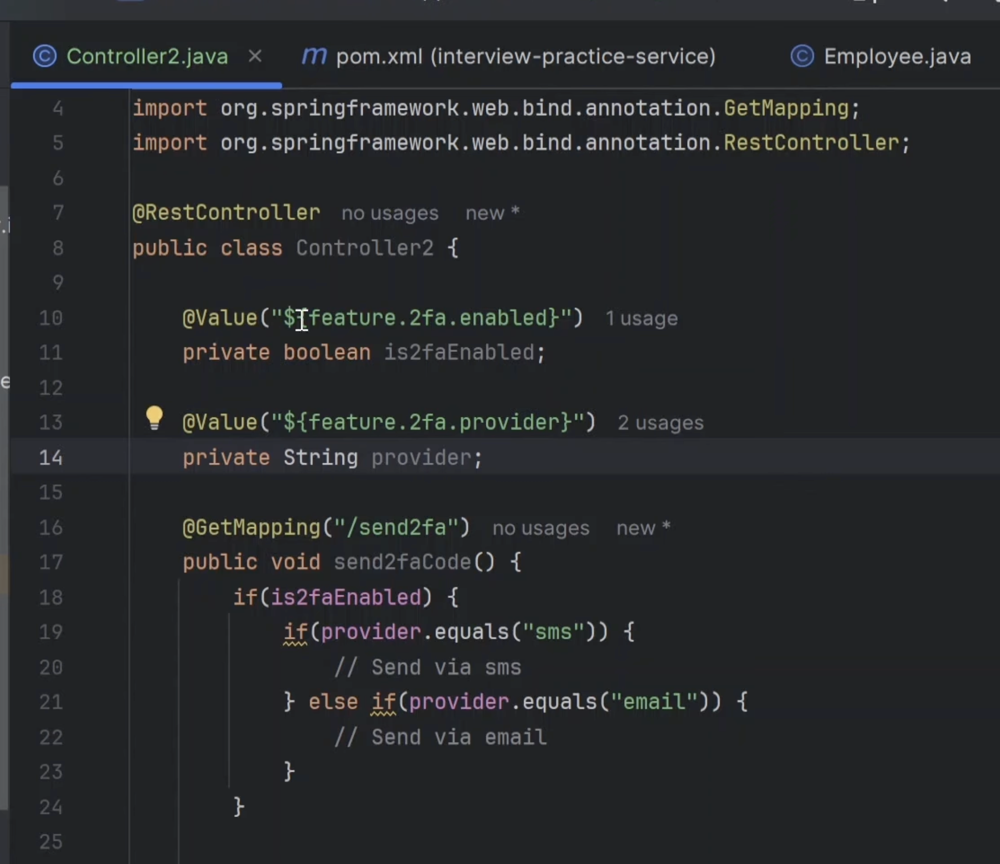
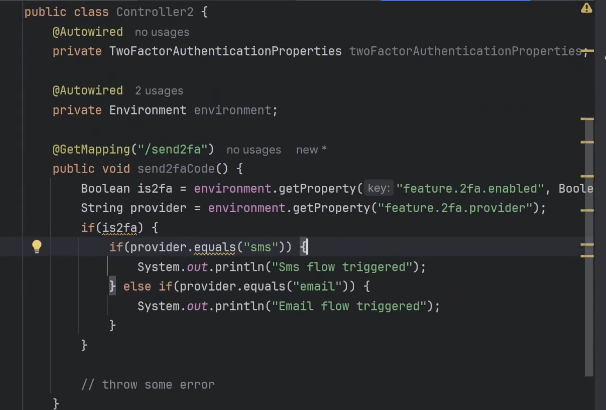

HOW TO ACCESS ENVIRONMENT PROPERTIES ?

-> So far we have discussed only spring boot built in environment properties.

Spring boot also allows us to create our own custom properties and we can access it using different ways:

ex: let say you want to enable a 2fa for your application and this has to be enabled only for prod not for test and dev 

I created key of my own and given different values in different env.
Now i have 2 use this in my application.

1. @Value
2. @ConfigurationProperties
3. Environment Reference

1. Value: 

we are injecting the value of the variable 2fa through Value annnotation.

Customizing multiple environement properties:

sending 2fa code: 
for dev and test: sms
for prod: email

Drawback of @Value: 
This feature.2fa.enabled is used twice in code, when we reusing the property many times.

2. ConfigurationProperties: 

Create class and only one time injection of values takes place and we can reuse it as many times.

3. Environment interface:
This is provided by spring boot only. 
This interface extends PropertyResolver interface 

This is not good way.
-> if we change any key then we need to change where ever it is used.
   But using ConfigurationProperties need to change only in one class.

-> Even for @Value as well you have to change wherever u are using this annotation.

So best practice is to use ConfigurationProperties.

Boolean is2fa = environment.getProperty("feature.2fa.enabled", Boolean.class);
String privoider = environment.getProperty("feature.2fa.provider");